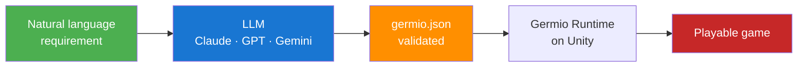
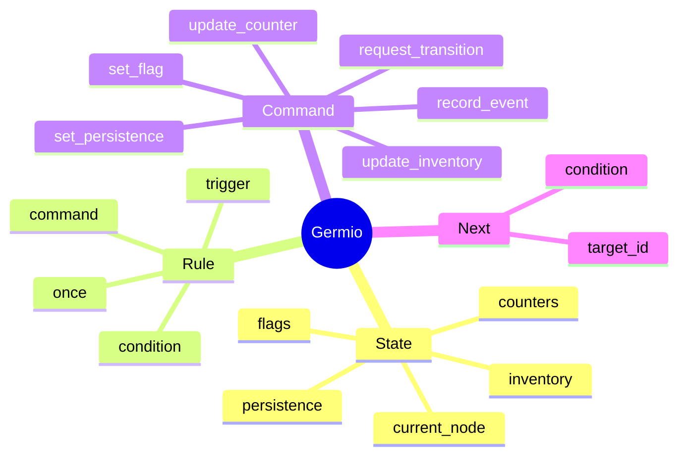
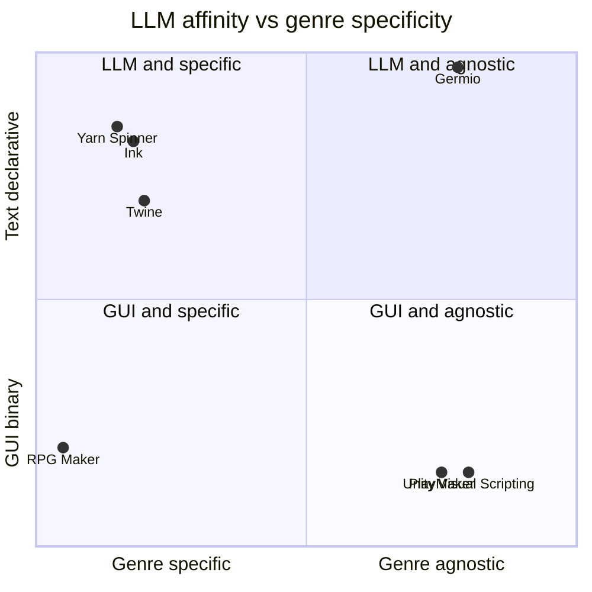
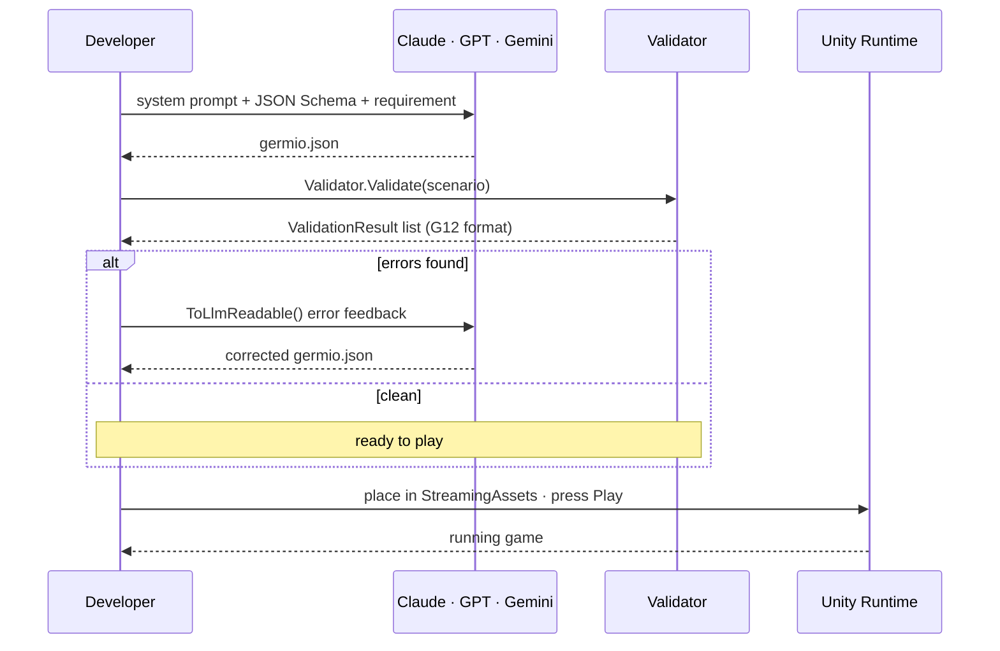
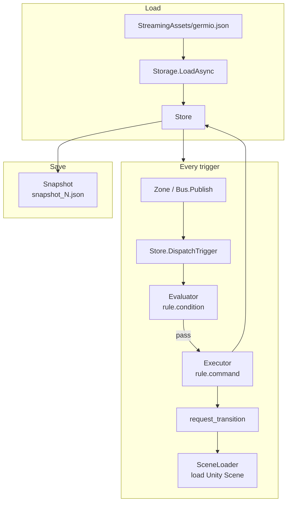
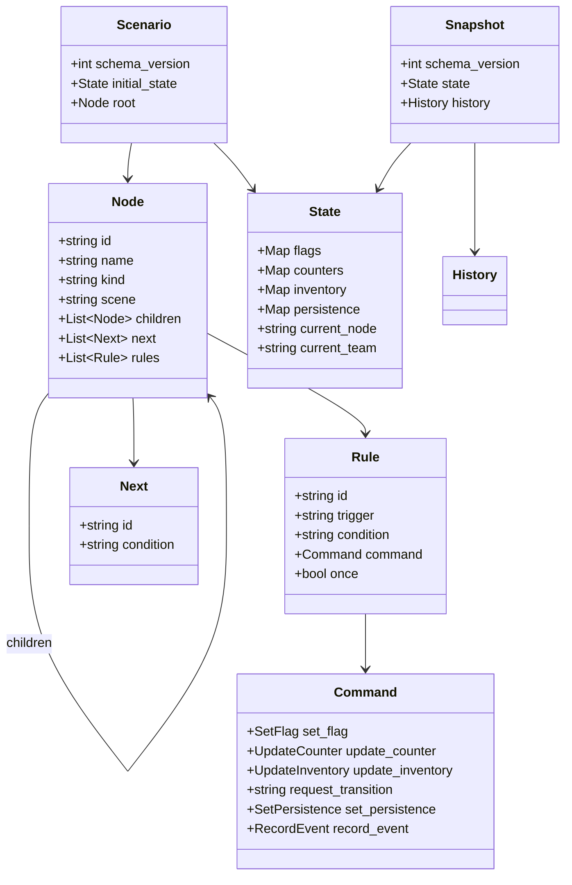
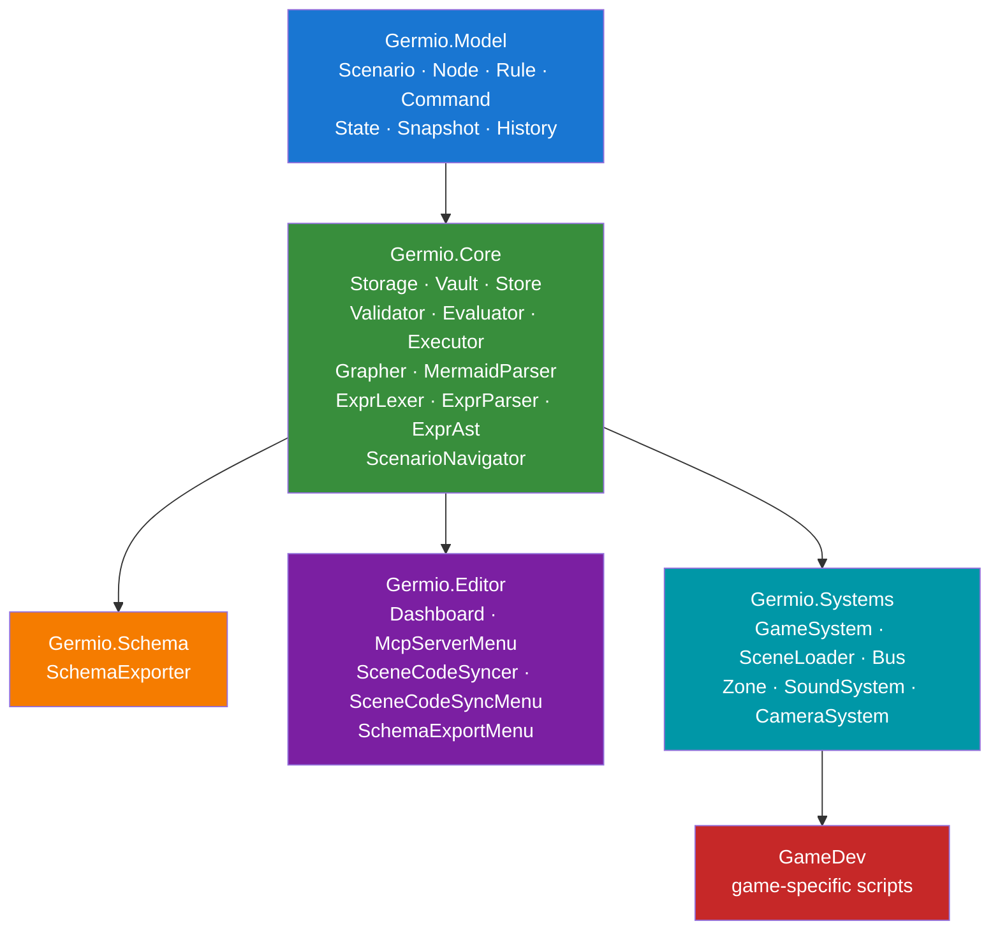

# Germio

> **The LLM-Native Game Progression Framework for Unity.**
> Describe your game in natural language. Let an LLM author the logic. Ship it.

[](https://unity.com/)
[]()
[](LICENSE)

---

## What is Germio?

Germio is a Unity framework where **game progression logic lives entirely in a single JSON file** — authored by an LLM, validated automatically, and executed by a lightweight runtime. No visual scripting. No node graphs. No hand-written state machines.



---

## Four concepts. That is the whole model.



Any Unity game progression you can name, expressed as **State · Rule · Command · Next**. No more concepts will ever be added to the core model.

---

## Why LLM-Native?

Most data-driven frameworks were designed for human designers. Germio was designed so that an LLM can write the data **without help**.



Six measured properties make Germio LLM-Native:

| Property | Implementation |
|---|---|
| `snake_case` throughout all layers | G17 naming theorem |
| Public JSON Schema (Draft 2020-12) | `schemas/germio.schema.json` |
| Self-correcting validator errors | `Validator` → `ToLlmReadable()` G12 format |
| Minimal closed DSL for conditions | `ExprLexer` + `ExprParser` + `Evaluator` |
| Bidirectional Mermaid conversion | `Grapher.Export()` + `MermaidParser.Parse()` |
| Multi-LLM neutral design | Claude / GPT-4 / Gemini prompt packs included |

---

## A 30-second example

You write:

> Five stage action game. Each stage clears when the player reaches the goal. Three lives total.

LLM produces a validated `germio.json`. The Germio runtime plays it.



---

## Runtime flow



---

## Data model



---

## Namespace architecture



---

## Files

| File | Role | LLM-editable |
|---|---|---|
| `StreamingAssets/germio.json` | Scenario definition (static, plaintext) | ✅ Yes |
| `StreamingAssets/germio.dat` | Scenario, AES-CBC encrypted (release) | ❌ No |
| `StreamingAssets/snapshot_{slot}.json` | Runtime snapshot per save slot (plaintext) | ❌ No |
| `StreamingAssets/snapshot_{slot}.dat` | Runtime snapshot per save slot (encrypted) | ❌ No |
| `StreamingAssets/germio_key.bin` | AES-256 key (48 bytes) | ❌ No |
| `schemas/germio.schema.json` | JSON Schema Draft 2020-12 | ✅ Reference |

---

## Editor menus

| Menu | Role |
|---|---|
| `Germio > Dashboard` | Load `germio.json`, run Validator, view scenario tree |
| `Tools > Germio > Export Schema to Clipboard` | Copy `germio.schema.json` for LLM prompts |
| `Tools > Germio > Sync Scene Code` | Sync C# Scene classes with `germio.json` |
| `Tools > Germio > MCP Server > Start MCP Server` | *(stub — Phase 7)* |
| `Tools > Germio > MCP Server > Stop MCP Server` | *(stub — Phase 7)* |

---

## Getting started

```sh
# Use as a submodule
git submodule add https://github.com/hiroxpepe/germio.git \
    game/Assets/Plugins/Germio

# Or copy the folder directly into your Unity project
# Requires: Unity 6 LTS + Newtonsoft.Json (com.unity.nuget.newtonsoft-json)
```

1. Place your scenario at `Assets/StreamingAssets/germio.json`
2. Open `Germio > Dashboard` in the Unity Editor to validate
3. Press Play

---

## Documentation

| Document | Purpose |
|---|---|
| [LLM Workflow Guide](../../docs/llm_workflow_guide.md) | End-to-end LLM authoring guide |
| [Pattern Library Cookbook](../../docs/germio_cookbook.md) | 32 ready-to-use patterns |
| [DSL Specification](../../docs/germio_dsl_spec.md) | EBNF grammar for conditions |
| [LLM-First Design](../../docs/llm_first_design.md) | Design principles G9–G21 |
| [Naming Convention](../../docs/naming_convention.md) | G16–G18 naming theorem |
| [Security Model](../../docs/germio_security_model.md) | AES key management |
| [Save Data Format](../../docs/germio_save_data_format.md) | Snapshot format and schema |
| [MCP Design](../../docs/mcp_design.md) | Future MCP server design (Phase 7) |

**Reference game**: [Stemic](https://github.com/hiroxpepe/stemic) — a full Unity 3D action game built on Germio.

---

## License

MIT — see [LICENSE](LICENSE).
