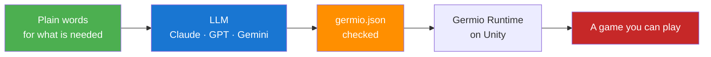
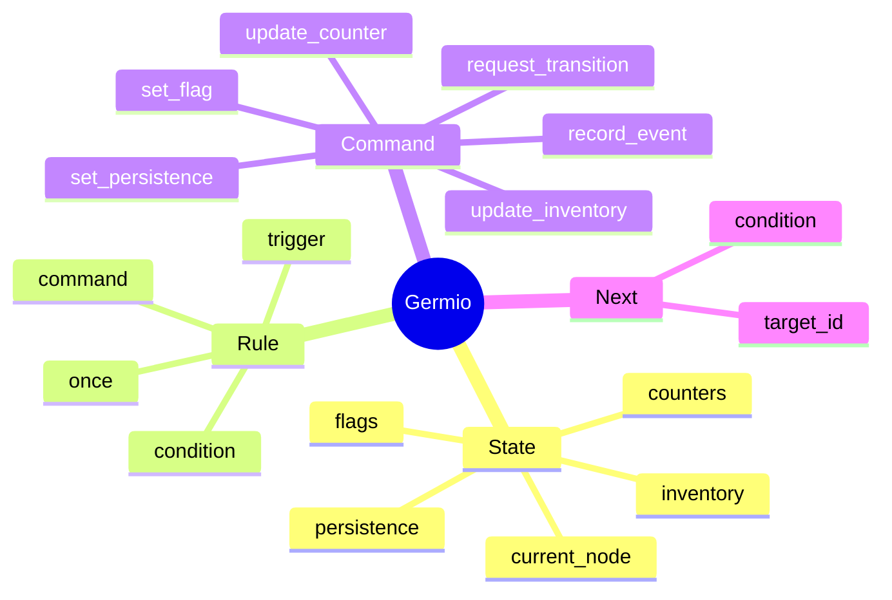
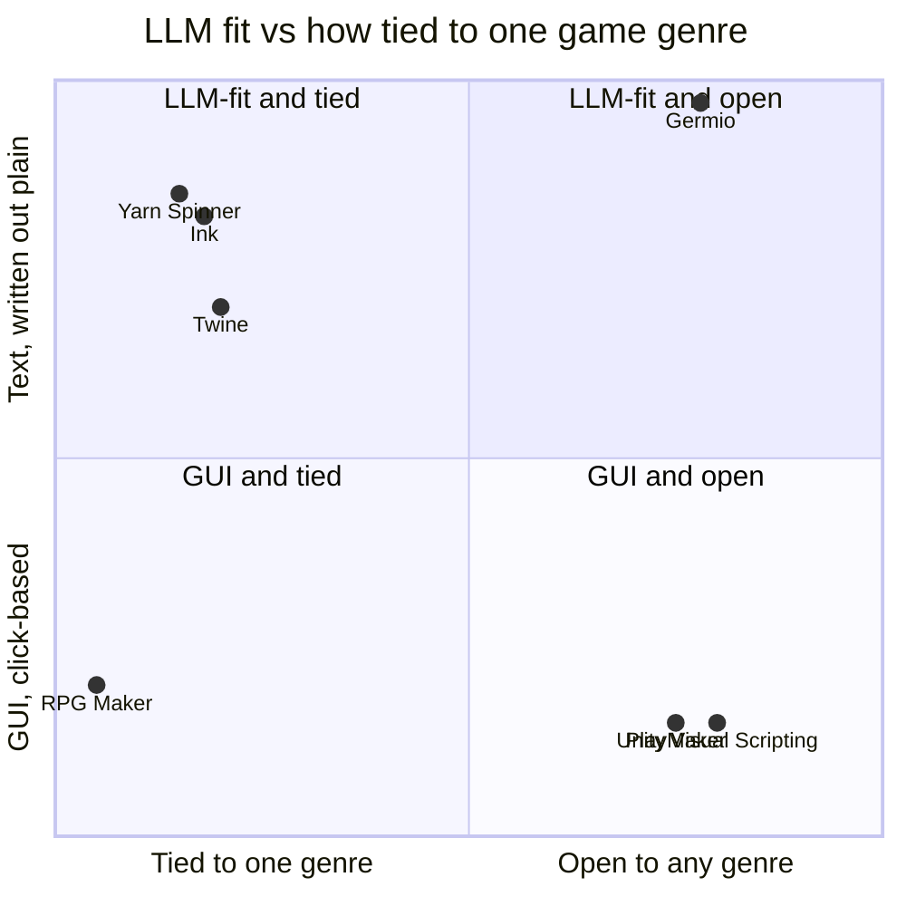
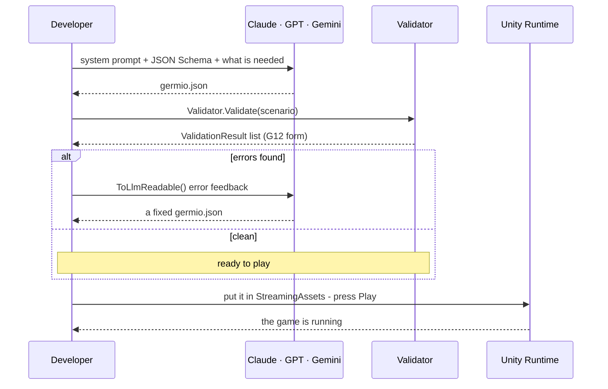
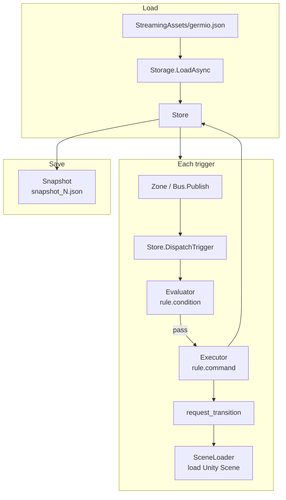
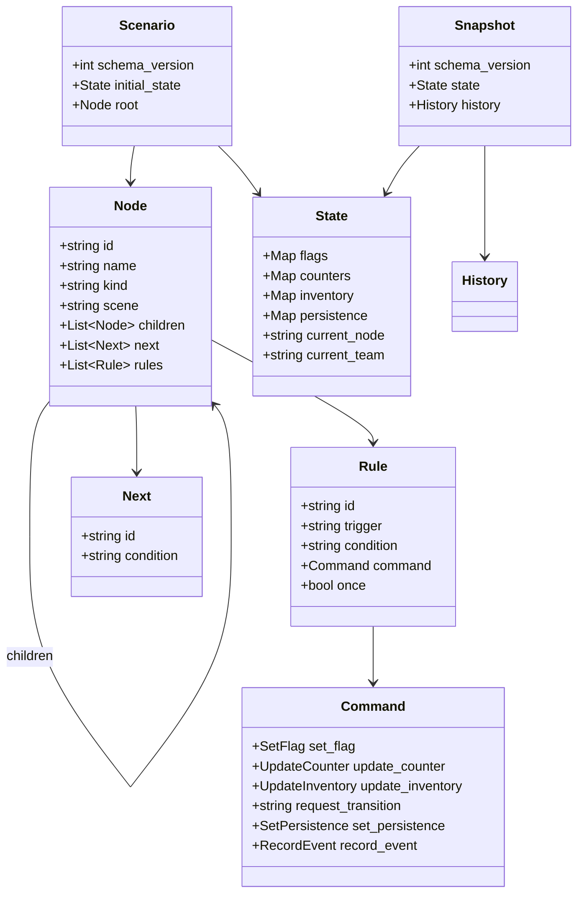
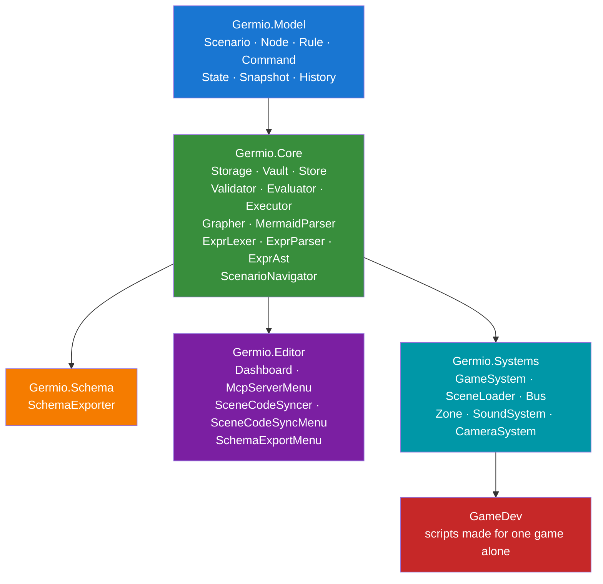

# Germio

> **The LLM-Native Game Progress Framework for Unity.**
> Say what your game is like, in plain words. Let an LLM write the
> rules. Ship it.

[](https://unity.com/)


[](LICENSE)

---

## What is Germio?

Germio is a Unity framework where **the game's own rules for moving
forward all live in one, single JSON file** — written by an LLM,
checked by machine on its own, and run by a light runtime. No
visual scripting. No node graphs. No hand-written state machines.


```mermaid
flowchart LR
    HUMAN[Plain words\nfor what is needed] --> LLM[LLM\nClaude · GPT · Gemini]
    LLM --> JSON[germio.json\nchecked]
    JSON --> RUNTIME[Germio Runtime\non Unity]
    RUNTIME --> GAME[A game you can play]

    style HUMAN fill:#4caf50,color:#fff
    style LLM  fill:#1976d2,color:#fff
    style JSON fill:#FF8F00,color:#fff
    style GAME fill:#c62828,color:#fff
```

---

## Four ideas: that is the whole model


```mermaid
mindmap
  root((Germio))
    State
      flags
      counters
      inventory
      persistence
      current_node
    Rule
      trigger
      condition
      command
      once
    Command
      set_flag
      update_counter
      update_inventory
      request_transition
      set_persistence
      record_event
    Next
      target_id
      condition
```

Any way a Unity game can move forward, put into words as
**State · Rule · Command · Next**. No more ideas will ever be
added to the core model.

---

## Why LLM-Native?

Most data-driven frameworks were made for a human designer. Germio
was made so an LLM can write the data **with no help at all**.


```mermaid
quadrantChart
    title LLM fit vs how tied to one game genre
    x-axis "Tied to one genre" --> "Open to any genre"
    y-axis "GUI, click-based" --> "Text, written out plain"
    quadrant-1 "LLM-fit and open"
    quadrant-2 "LLM-fit and tied"
    quadrant-3 "GUI and tied"
    quadrant-4 "GUI and open"
    "PlayMaker": [0.75, 0.15]
    "Unity Visual Scripting": [0.80, 0.15]
    "Yarn Spinner": [0.15, 0.85]
    "Ink": [0.18, 0.82]
    "Twine": [0.20, 0.70]
    "RPG Maker": [0.05, 0.20]
    "Germio": [0.78, 0.97]
```

Six measured traits make Germio LLM-Native:

| Trait | How it is built |
| --- | --- |
| `snake_case` right through every layer | the G17 naming theorem |
| An open JSON Schema (Draft 2020-12) | `schemas/germio.schema.json` |
| Errors that check themselves and say why | `Validator` → `ToLlmReadable()`, in G12 form |
| A small, closed DSL for conditions | `ExprLexer` + `ExprParser` + `Evaluator` |
| Change both ways, between code and Mermaid | `Grapher.Export()` + `MermaidParser.Parse()` |
| A design that plays no favorites among LLMs | prompt packs for Claude, GPT-4, and Gemini, all included |

---

## A thirty-second example

You write:

> A game of five stages. Each stage is won once the player reaches
> the goal. Three lives, in all.

The LLM makes a `germio.json` that has already been checked. The
Germio runtime plays it.


```mermaid
sequenceDiagram
    participant Dev as Developer
    participant LLM as Claude · GPT · Gemini
    participant Val as Validator
    participant Unity as Unity Runtime

    Dev->>LLM: system prompt + JSON Schema + what is needed
    LLM-->>Dev: germio.json
    Dev->>Val: Validator.Validate(scenario)
    Val-->>Dev: ValidationResult list (G12 form)
    alt errors found
        Dev->>LLM: ToLlmReadable() error feedback
        LLM-->>Dev: a fixed germio.json
    else clean
        Note over Dev,Val: ready to play
    end
    Dev->>Unity: put it in StreamingAssets - press Play
    Unity-->>Dev: the game is running
```

---

## How the runtime moves through the game


```mermaid
flowchart TD
    subgraph LOAD[Load]
        SA[StreamingAssets/germio.json] --> STORAGE[Storage.LoadAsync]
        STORAGE --> STORE[Store]
    end

    subgraph TICK[Each trigger]
        ZONE[Zone / Bus.Publish] --> DISPATCH[Store.DispatchTrigger]
        DISPATCH --> EVAL[Evaluator\nrule.condition]
        EVAL -->|pass| EXEC[Executor\nrule.command]
        EXEC --> RT[request_transition]
        RT --> SCENE[SceneLoader\nload Unity Scene]
    end

    subgraph SAVE[Save]
        STORE --> SNAP[Snapshot\nsnapshot_N.json]
    end

    STORE --> TICK
    EXEC --> STORE
```

---

## The data model


```mermaid
classDiagram
    class Scenario {
        +int schema_version
        +State initial_state
        +Node root
    }
    class Node {
        +string id
        +string name
        +string kind
        +string scene
        +List~Node~ children
        +List~Next~ next
        +List~Rule~ rules
    }
    class State {
        +Map flags
        +Map counters
        +Map inventory
        +Map persistence
        +string current_node
        +string current_team
    }
    class Rule {
        +string id
        +string trigger
        +string condition
        +Command command
        +bool once
    }
    class Command {
        +SetFlag set_flag
        +UpdateCounter update_counter
        +UpdateInventory update_inventory
        +string request_transition
        +SetPersistence set_persistence
        +RecordEvent record_event
    }
    class Next {
        +string id
        +string condition
    }
    class Snapshot {
        +int schema_version
        +State state
        +History history
    }

    Scenario --> State
    Scenario --> Node
    Node --> Node : children
    Node --> Next
    Node --> Rule
    Rule --> Command
    Snapshot --> State
    Snapshot --> History
```

---

## How the namespaces are built


```mermaid
flowchart TB
    MODEL[Germio.Model\nScenario · Node · Rule · Command\nState · Snapshot · History]
    CORE[Germio.Core\nStorage · Vault · Store\nValidator · Evaluator · Executor\nGrapher · MermaidParser\nExprLexer · ExprParser · ExprAst\nScenarioNavigator]
    SCHEMA[Germio.Schema\nSchemaExporter]
    EDITOR[Germio.Editor\nDashboard · McpServerMenu\nSceneCodeSyncer · SceneCodeSyncMenu\nSchemaExportMenu]
    SYSTEMS[Germio.Systems\nGameSystem · SceneLoader · Bus\nZone · SoundSystem · CameraSystem]
    GAMEDEV[GameDev\nscripts made for one game alone]

    MODEL --> CORE
    CORE --> SCHEMA
    CORE --> EDITOR
    CORE --> SYSTEMS
    SYSTEMS --> GAMEDEV

    style MODEL  fill:#1976d2,color:#fff
    style CORE   fill:#388e3c,color:#fff
    style SCHEMA fill:#f57c00,color:#fff
    style EDITOR fill:#7b1fa2,color:#fff
    style SYSTEMS fill:#0097a7,color:#fff
    style GAMEDEV fill:#c62828,color:#fff
```

---

## Files

| File | What it holds | Can an LLM change it |
| --- | --- | --- |
| `StreamingAssets/germio.json` | the scenario itself (fixed, plain text) | Yes |
| `StreamingAssets/germio.dat` | the scenario, coded with AES-CBC (for release) | No |
| `StreamingAssets/snapshot_{slot}.json` | a runtime snapshot, per save slot (plain text) | No |
| `StreamingAssets/snapshot_{slot}.dat` | a runtime snapshot, per save slot (coded) | No |
| `StreamingAssets/germio_key.bin` | the AES-256 key (48 bytes) | No |
| `schemas/germio.schema.json` | the JSON Schema, Draft 2020-12 | as a guide only |

---

## The Editor's own menus

| Menu | What it does |
| --- | --- |
| `Germio > Dashboard` | loads `germio.json`, runs the Validator, shows the scenario as a tree |
| `Tools > Germio > Export Schema to Clipboard` | copies `germio.schema.json`, for use in an LLM prompt |
| `Tools > Germio > Sync Scene Code` | keeps the C# Scene classes in step with `germio.json` |
| `Tools > Germio > MCP Server > Start MCP Server` | *(a stand-in only — for Phase 7)* |
| `Tools > Germio > MCP Server > Stop MCP Server` | *(a stand-in only — for Phase 7)* |

---

## Getting started

```sh
# Use it as a submodule
git submodule add https://github.com/hiroxpepe/germio.git \
    game/Assets/Plugins/Germio

# Or copy the folder straight into your own Unity project
# Needs: Unity 6 LTS + Newtonsoft.Json (com.unity.nuget.newtonsoft-json)
```

1. Put your own scenario at `Assets/StreamingAssets/germio.json`
2. Open `Germio > Dashboard`, in the Unity Editor, to check it
3. Press Play

---

## Papers

| Paper | What it is for |
| --- | --- |
| [LLM Workflow Guide](../../docs/llm_workflow_guide.md) | a start-to-end guide for writing with an LLM |
| [Pattern Library Cookbook](../../docs/germio_cookbook.md) | 32 ready-to-use patterns |
| [DSL Specification](../../docs/germio_dsl_spec.md) | the EBNF grammar for conditions |
| [LLM-First Design](../../docs/llm_first_design.md) | design rules G9-G21 |
| [Naming Convention](../../docs/naming_convention.md) | the G16-G18 naming theorem |
| [Security Model](../../docs/germio_security_model.md) | AES key handling |
| [Save Data Format](../../docs/germio_save_data_format.md) | the snapshot's own form and schema |
| [MCP Design](../../docs/mcp_design.md) | a future MCP server design (Phase 7) |

**A game built to show this working**:
[Stemic](https://github.com/hiroxpepe/stemic) — a full Unity 3D
action game, built on Germio.

---

## License

MIT — see [LICENSE](LICENSE).
