# Germio Framework Detailed Plan v2.2 (LLM-runnable form)

> Target: `game/Assets/Plugins/Germio/` and `game/Assets/Scripts/`
> Base documents: `overview_JP.md` / `overview_EN.md` / a full read of the project's code (as of 2026-04-29, after the refactor)
> Written: 2026-04-29 / **LLM-runnable form (a polish of v2.1)**
> Meant for: Claude Code / Cursor / other coding agents. Written at a grain fine enough that handing over this document alone lets an agent run from the start of P4 through to P8 on its own.

---

## 0. Why this was rewritten as v2.2

### 0.1 Phase 5.8 v2 (2026-05) — done

This document is written on the base that **Phase 5.8 v2** — the refactor done before starting Phase 4 (the LLM-Native DSL base) — is finished. For the full detail of what Phase 5.8 v2 changed, see the git history, the list of main changes in §0.1 below, and `prompts/CHANGELOG.md`.

Main changes:

+ Folded the World/Level classes into Node (a tree that can go up to 10 layers deep)
+ Added the History class (an event log, now a first-class idea)
+ Kept Scenario and Snapshot in separate files (`germio.json` and `snapshot_*.json`)
+ Renamed `State.current_scene` to `current_node`
+ Folded `State.fired_rules` into History
+ Took out `Migrator.cs` (not needed, since the schema was not yet public)
+ Grew the DSL (`history.*`: `count`, `has`, `last`, `time_since`, `session_count`, `total_play_time`)

Fix patches (after Phase 5.8 v2 was done):

+ Took out the `Store.state` property (removed a form of Anti-Pattern A)
+ Took out the `Next.target` property (removed a stray addition not in the spec)
+ Rewrote the Cookbook's 27 patterns in v2 form
+ Added Cookbook Section 7 (History-Dependent Patterns)

### 0.2 What v2.1 did, and where it fell short

v2.1 (2026-04-28), as the **strategy-change version**, laid out the case for calling Germio an "LLM-Native game-building framework". Design rules (G9-G16), a roadmap, a look at rivals, the file layout — as a plan, it held enough.

But v2.1 was **too rough-grained to work from as direct steps for an LLM agent**:

+ It said "bring the Validator up to G12" but never said **which method gets which new argument**
+ It said "make the JSON Schema public" but never said **which NJsonSchema API to call, or what goes in which folder**
+ It said "two-way Mermaid conversion" but never said **the method's shape to match `Grapher.Export`, or how a test tells a round trip passed**
+ Each task was missing its **DoD (Definition of Done) and how to check it**

### 0.2 What v2.2 is for

v2.2 keeps v2.1's strategy, but rebuilds it into **build steps an LLM agent can read and begin work from right away**. In full, that means:

1. **Each task states its "files touched", "before", "after", "DoD", and "test needs"**
2. **Class names, property names, and method names are fixed to match the real code after the refactor** (`Scenario` / `State` / `Level` / `Rule` / `Command` / `set_flag` / `fired_rules` / `Bus` / `Zone`, and so on)
3. **Since files sit under layered namespaces (`Germio.Model` / `Germio.Core` / `Germio.Systems`, and so on), the exact `using` lines are stated too**
4. **Adds two new rules, G17 (the Naming-Layer Theorem) and G18 (Layered Namespace)**, giving an LLM a clear rule to follow when it builds a new file
5. **States the build order, what can run side by side, and each task's dependencies**, so an LLM can lay out its own work plan

### 0.3 How to read this document (for an LLM)

The LLM agent running this document works under these terms:

+ **Working folders**: `game/Assets/Plugins/Germio/`, `game/Assets/Scripts/`, and `game/tests/IntegrationTests/`
+ **Test command**: `cd game/tests/IntegrationTests && dotnet test --logger "console;verbosity=normal"`
+ **Test count right now**: 154, all GREEN
+ **Git commits**: **not allowed**. Leave every change in the working tree; a human reviews it, then commits by hand
+ **How each task is checked as done**: its own §DoD is met, and `dotnet test` is GREEN
+ **When stuck**: do not guess. Ask a human

### 0.4 How v2.0, v2.1, and v2.2 relate

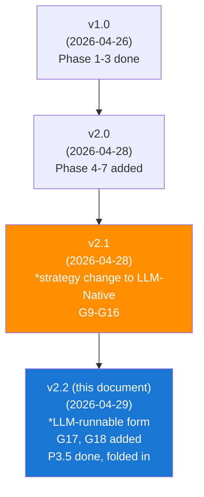
```mermaid
flowchart TD
    V1["v1.0<br/>(2026-04-26)<br/>Phase 1-3 done"]
    V2["v2.0<br/>(2026-04-28)<br/>Phase 4-7 added"]
    V21["v2.1<br/>(2026-04-28)<br/>*strategy change to LLM-Native<br/>G9-G16"]
    V22["v2.2 (this document)<br/>(2026-04-29)<br/>*LLM-runnable form<br/>G17, G18 added<br/>P3.5 done, folded in"]

    V1 --> V2 --> V21 --> V22

    style V21 fill:#FF8F00,color:#fff
    style V22 fill:#1976d2,color:#fff
```

**v2.2 does not go against v2.1; it rebuilds it into steps an LLM can build from.** The strategy, the rules, and the roadmap are all carried over from v2.1.

---

## 1. Why the strategy changed — reading the state of the field

### 1.1 Where LLMs and game-making stand (as of April 2026)

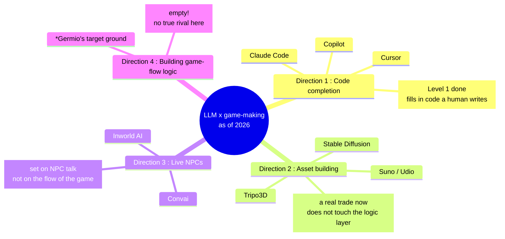
```mermaid
mindmap
  root((LLM x game-making<br/>as of 2026))
    Direction 1 : Code completion
      Copilot
      Cursor
      Claude Code
      note["Level 1 done<br/>fills in code a human writes"]
    Direction 2 : Asset building
      Stable Diffusion
      Suno / Udio
      Tripo3D
      note["a real trade now<br/>does not touch the logic layer"]
    Direction 3 : Live NPCs
      Inworld AI
      Convai
      note["set on NPC talk<br/>not on the flow of the game"]
    Direction 4 : Building game-flow logic
      *Germio's target ground
      note["empty!<br/>no true rival here"]
```

### 1.2 Three levels of how far LLM-run building has come

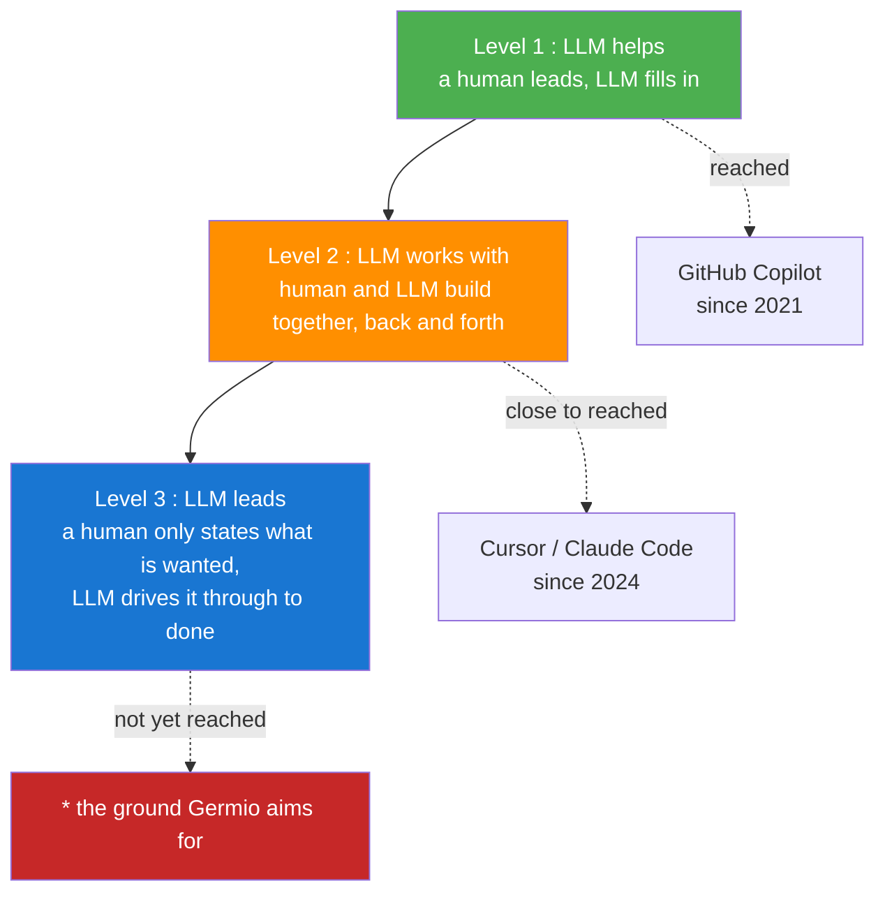
```mermaid
flowchart TD
    L1[Level 1 : LLM helps<br/>a human leads, LLM fills in] --> L2
    L2[Level 2 : LLM works with<br/>human and LLM build together, back and forth] --> L3
    L3[Level 3 : LLM leads<br/>a human only states what is wanted,<br/>LLM drives it through to done]

    L1 -.reached.-> A1[GitHub Copilot<br/>since 2021]
    L2 -.close to reached.-> A2[Cursor / Claude Code<br/>since 2024]
    L3 -.not yet reached.-> A3[* the ground Germio aims for]

    style L1 fill:#4caf50,color:#fff
    style L2 fill:#FF8F00,color:#fff
    style L3 fill:#1976d2,color:#fff
    style A3 fill:#c62828,color:#fff
```

The reason Level 3 has not been reached yet is plain:

+ **What the LLM touches is "scattered C# code"**, and it has to read the whole codebase again each time
+ **The codebase carries unwritten rules, camps, and history**, so the LLM cannot give output that holds together
+ **Checking what was built** falls to a human reading it over

To fix all of this, **what the LLM touches must be closed inside a "structured, declarative form"**. Germio can be the very base that gives this.

### 1.3 Looking at rivals (from the LLM-driven view)

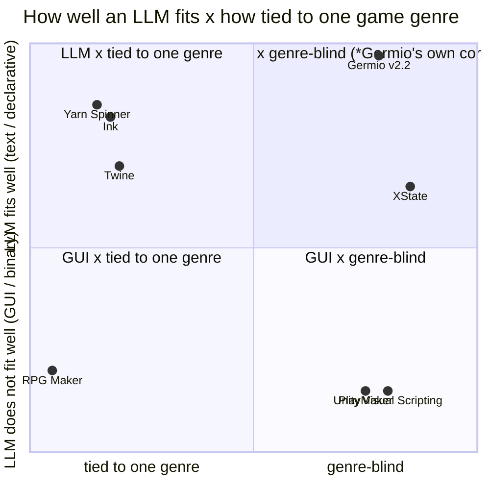
```mermaid
quadrantChart
    title How well an LLM fits x how tied to one game genre
    x-axis "tied to one genre" --> "genre-blind"
    y-axis "LLM does not fit well (GUI / binary)" --> "LLM fits well (text / declarative)"
    quadrant-1 "LLM x genre-blind (*Germio's own corner)"
    quadrant-2 "LLM x tied to one genre"
    quadrant-3 "GUI x tied to one genre"
    quadrant-4 "GUI x genre-blind"
    "PlayMaker": [0.75, 0.15]
    "Unity Visual Scripting": [0.80, 0.15]
    "Twine": [0.20, 0.70]
    "Yarn Spinner": [0.15, 0.85]
    "Ink": [0.18, 0.82]
    "XState": [0.85, 0.65]
    "RPG Maker": [0.05, 0.20]
    "Germio v2.2": [0.78, 0.97]
```

**"The top-right corner is fully empty"** — this is where Germio stands. Now that the naming work (G17/G18) is done, the Y axis (how well it fits an LLM) is marked up from v2.1's 0.95 to 0.97.

### 1.4 Timing — why "now"

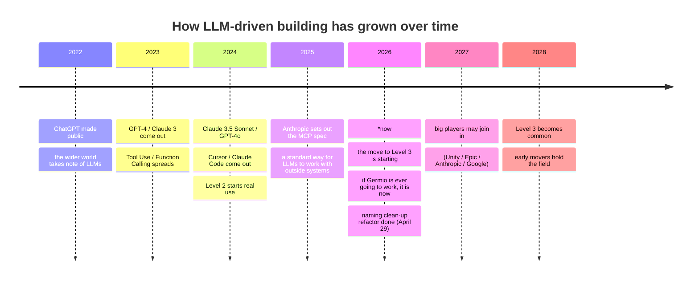
```mermaid
timeline
    title How LLM-driven building has grown over time
    2022 : ChatGPT made public
         : the wider world takes note of LLMs
    2023 : GPT-4 / Claude 3 come out
         : Tool Use / Function Calling spreads
    2024 : Claude 3.5 Sonnet / GPT-4o
         : Cursor / Claude Code come out
         : Level 2 starts real use
    2025 : Anthropic sets out the MCP spec
         : a standard way for LLMs to work with outside systems
    2026 : *now
         : the move to Level 3 is starting
         : if Germio is ever going to work, it is now
         : naming clean-up refactor done (April 29)
    2027 : big players may join in
         : (Unity / Epic / Anthropic / Google)
    2028 : Level 3 becomes common
         : early movers hold the field
```

**2026 sits right at the line between "getting ready" and "first mover wins".** In a year, there is a real chance that Unity Technologies or Epic Games will put out an official LLM link-up of their own. Germio's one true edge is **"finish it first, and put it out"**.

### 1.5 v1.0's design choices, re-read from the LLM-driven view (with what the refactor added)

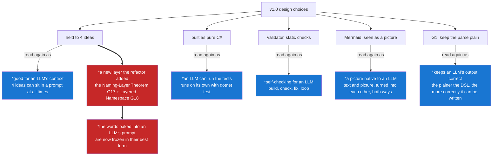
```mermaid
flowchart TD
    A[v1.0 design choices] --> A1[held to 4 ideas]
    A --> A2[built as pure C#]
    A --> A3[Validator, static checks]
    A --> A4[Mermaid, seen as a picture]
    A --> A5[G1, keep the parse plain]

    A1 -->|read again as| R1[*good for an LLM's context<br/>4 ideas can sit in a prompt at all times]
    A2 -->|read again as| R2[*an LLM can run the tests<br/>runs on its own with dotnet test]
    A3 -->|read again as| R3[*self-checking for an LLM<br/>build, check, fix, loop]
    A4 -->|read again as| R4[*a picture native to an LLM<br/>text and picture, turned into each other, both ways]
    A5 -->|read again as| R5[*keeps an LLM's output correct<br/>the plainer the DSL, the more correctly it can be written]

    A1 ==> A6[*a new layer the refactor added<br/>the Naming-Layer Theorem G17 + Layered Namespace G18]
    A6 ==> R6[*the words baked into an LLM's prompt<br/>are now frozen in their best form]

    style R1 fill:#1976d2,color:#fff
    style R2 fill:#1976d2,color:#fff
    style R3 fill:#1976d2,color:#fff
    style R4 fill:#1976d2,color:#fff
    style R5 fill:#1976d2,color:#fff
    style R6 fill:#c62828,color:#fff
    style A6 fill:#c62828,color:#fff
```

> **A key point in v2.2**: on top of v1.0's builder's **"answer found without knowing it"**, the 2026-04-29 refactor stood as **"the last, knowing pass of putting things in LLM-First order"**. Since this clean-up was done before the schema went public, **the names baked into an LLM's prompt are frozen from the very start in their best form** — an investment that every Germio user (human and LLM alike) keeps gaining from, one year on, three years on, ten years on.

---

## 2. v2.2 design rules (the axis an LLM should judge by, when it builds something new)

### 2.1 Rules kept from before

| # | Rule | How an LLM should read it |
| --- | --- | --- |
| G1 | keep the parse plain | keep it plain enough that an LLM can write it right in one try |
| G2 | an idempotency guard | keep both layers (Layer 1, `active_zones`; Layer 2, `fired_rules`) |

### 2.2 Technical rules from v2.0

| # | Rule | How an LLM should read it |
| --- | --- | --- |
| G3 | recursive descent, plus AND/OR/NOT | built in P4-T1. Match operator precedence to the C/Java family |
| G4 | compare with a margin of error | built in P4-T2. `abs(a-b) <= eps * max(abs(a), abs(b), 1)` |
| G5 | a fixed order | in P5-T2, `fired_rules` is changed to a `List<string>`, keeping the order things were added |
| G6 | plain key handling | in P5-T1, the `PlayerPrefs` fallback is taken out |

### 2.3 LLM-driven rules from v2.1

| # | Rule | Summary |
| --- | --- | --- |
| G9 | LLM-First | when "easy for a human to write" and "easy for an LLM to write" pull apart, **pick the LLM's side** |
| G10 | driven by JSON Schema | every structure is written as a JSON Schema (Draft 2020-12) |
| G11 | two-way picture-making | also build Mermaid → JSON |
| G12 | an error that fixes itself | every error is a set of three: `where + why + a fix` |
| G13 | prompts go out with the code | the `prompts/` folder is a first-class deliverable |
| G14 | neutral across LLMs | check that Claude, GPT, and Gemini all reach the same quality on a benchmark |
| G15 | the sign matches what is inside | keep wording set to "an LLM-Native game-flow framework" |
| G16 | see the LLM dogfood through | "an LLM alone finishes the Reference Game" is the mark for the v1.0 release |

### 2.4 *New rules added in v2.2

#### G17: the Naming-Layer Theorem

> **A C# property name = a JSON key = a key under the JSON Schema's `$defs` = the word an LLM sees in its prompt** — these four **must match, letter for letter, every time**.

**Rules for an LLM building this**:

+ write every new property in `snake_case`
+ never use the `[JsonProperty(...)]` attribute (Newtonsoft.Json already makes the C# name match the JSON key on its own)
+ a C# property name is not a mere "build detail" — it is **a public word in an LLM's prompt**

```csharp
// correct
public class State {
    public string current_scene { get; set; } = "";
    public List<string> fired_rules { get; set; } = new();
}

// wrong: never map to another name with [JsonProperty]
public class State {
    [JsonProperty("current_scene")]
    public string CurrentScene { get; set; } = "";  // this pulls the four layers apart
}
```

#### G18: Layered Namespace

> **Call the same idea by the same name.** A clash is settled by where a namespace sits, not by changing the word. **Making up a second word for the same thing is not allowed.**

**Rules for an LLM building this**:

| Where a new file goes | namespace |
| --- | --- |
| right under `Scripts/` (a tool used across the whole codebase) | `Germio` |
| `Scripts/Model/` | `Germio.Model` |
| `Scripts/Core/` | `Germio.Core` |
| `Scripts/Schema/` | `Germio.Schema` |
| `Scripts/Systems/` | `Germio.Systems` |
| `Scripts/Triggers/` | `Germio.Triggers` |
| `Scripts/Players/` | `Germio.Players` |
| `Scripts/Levels/` | `Germio.Levels` |
| `Scripts/Editor/` | `Germio.Editor` |
| `tests/IntegrationTests/Scripts/Model/` | `Germio.Tests.Model` |
| `tests/IntegrationTests/Scripts/Core/` | `Germio.Tests.Core` |
| `tests/IntegrationTests/Scripts/Systems/` | `Germio.Tests.Systems` |

`Germio.Model.Level` (in the data layer) and `Germio.Levels.Level` (in the MonoBehaviour layer) **live side by side under the same name**. Where they clash, `using` states which layer is meant. Where both are used at once, the clash is settled with an alias: `using ModelLevel = Germio.Model.Level;`.

---

## 3. The v2.1 → v2.2 change map (what an LLM must take in)

### 3.1 The renaming table (the refactor is already done)

An LLM uses this table as a reference: **"if the old name from v2.1's text turns up, read it as the new name"**.

#### Classes and types (17 items, refactor done)

| old name in v2.1's text | new name, from v2.2 | namespace |
| --- | --- | --- |
| `InputMaper` | `InputMapper` | `Germio` |
| `DataRoot` | `Scenario` | `Germio.Model` |
| `DataState` | `State` | `Germio.Model` |
| `DataWorld` | `World` | `Germio.Model` |
| `DataLevel` | `Level` | `Germio.Model` |
| `DataNext` | `Next` | `Germio.Model` |
| `DataEvent` | `Rule` | `Germio.Model` |
| `DataAction` | `Command` | `Germio.Model` |
| `DataSetFlag` | `SetFlag` | `Germio.Model` |
| `DataUpdateCounter` | `UpdateCounter` | `Germio.Model` |
| `DataUpdateInventory` | `UpdateInventory` | `Germio.Model` |
| `TriggerHub` | `Bus` | `Germio.Systems` |
| `VolumeTrigger` | `Zone` | `Germio.Systems` |
| `SEClip` | `SfxClip` | `Germio` (Enums) |
| `BGMClip` | `MusicClip` | `Germio` (Enums) |

#### Properties and JSON keys (turned into snake_case)

| in v2.1's text | from v2.2 |
| --- | --- |
| `currentScene` | `current_scene` |
| `currentTeam` | `current_team` |
| `firedEvents` | `fired_rules` (the idea's name changed too) |
| `setFlag` | `set_flag` |
| `updateCounter` | `update_counter` |
| `updateInventory` | `update_inventory` |
| `requestTransition` | `request_transition` |
| a Level's `events` | `rules` (idea's name changed) |
| a Rule's `action` | `command` (idea's name changed) |
| a Zone's `triggerId` | `zone_id` |

#### Folders

| in v2.1's text | from v2.2 |
| --- | --- |
| `Cores/` | `Triggers/` |
| `Serializer/` | `Core/` |
| (none) | `Schema/` (an empty folder made in P3.5, filled in P4-T5) |

#### Methods

| in v2.1's text | from v2.2 |
| --- | --- |
| `TriggerHub.OnAreaEnter` | `Bus.OnZoneEnter` |
| `TriggerHub.OnAreaExit` | `Bus.OnZoneExit` |
| `TriggerHub.OnSignalReceived` | `Bus.Publish` |
| `Store.DispatchTrigger` | `Store.Dispatch` |
| `Store.root` (property) | `Store.scenario` |

### 3.2 Changes, section by section

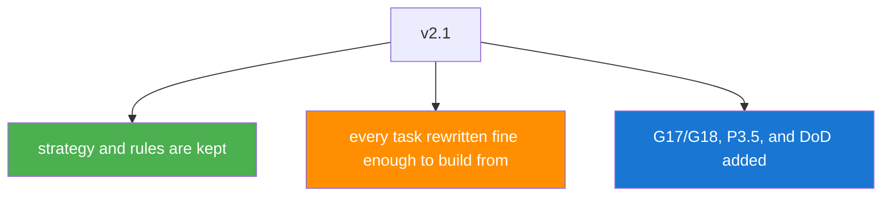
```mermaid
flowchart TD
    V21[v2.1] --> KEEP[strategy and rules are kept]
    V21 --> CHANGE[every task rewritten fine enough to build from]
    V21 --> ADD[G17/G18, P3.5, and DoD added]

    style KEEP fill:#4caf50,color:#fff
    style CHANGE fill:#FF8F00,color:#fff
    style ADD fill:#1976d2,color:#fff
```

---

## 4. The full roadmap

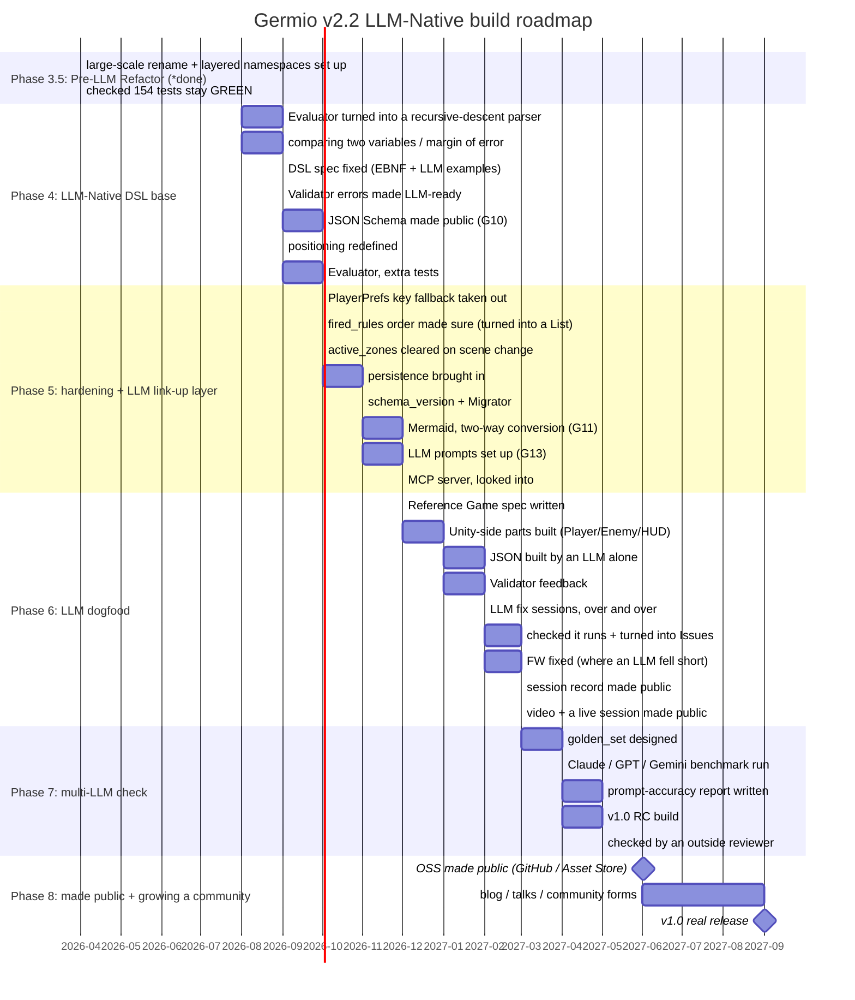
```mermaid
gantt
    title Germio v2.2 LLM-Native build roadmap
    dateFormat  YYYY-MM
    axisFormat  %Y-%m

    section Phase 3.5: Pre-LLM Refactor (*done)
    large-scale rename + layered namespaces set up   :done, p35-1, 2026-04, 2026-04
    checked 154 tests stay GREEN                      :done, p35-2, 2026-04, 2026-04

    section Phase 4: LLM-Native DSL base
    Evaluator turned into a recursive-descent parser :p4-1, 2026-08, 2026-09
    comparing two variables / margin of error         :p4-2, 2026-08, 2026-09
    DSL spec fixed (EBNF + LLM examples)              :p4-3, 2026-09, 2026-09
    Validator errors made LLM-ready                   :p4-4, 2026-09, 2026-09
    JSON Schema made public (G10)                     :p4-5, 2026-09, 2026-10
    positioning redefined                             :p4-6, 2026-09, 2026-09
    Evaluator, extra tests                            :p4-7, 2026-09, 2026-10

    section Phase 5: hardening + LLM link-up layer
    PlayerPrefs key fallback taken out                :p5-1, 2026-10, 2026-10
    fired_rules order made sure (turned into a List)  :p5-2, 2026-10, 2026-10
    active_zones cleared on scene change               :p5-3, 2026-10, 2026-10
    persistence brought in                            :p5-4, 2026-10, 2026-11
    schema_version + Migrator                         :p5-5, 2026-11, 2026-11
    Mermaid, two-way conversion (G11)                 :p5-6, 2026-11, 2026-12
    LLM prompts set up (G13)                          :p5-7, 2026-11, 2026-12
    MCP server, looked into                           :p5-8, 2026-12, 2026-12

    section Phase 6: LLM dogfood
    Reference Game spec written                       :p6-1, 2026-12, 2026-12
    Unity-side parts built (Player/Enemy/HUD)         :p6-2, 2026-12, 2027-01
    JSON built by an LLM alone                        :p6-3, 2027-01, 2027-02
    Validator feedback                                :p6-4, 2027-01, 2027-02
    LLM fix sessions, over and over                   :p6-5, 2027-02, 2027-02
    checked it runs + turned into Issues               :p6-6, 2027-02, 2027-03
    FW fixed (where an LLM fell short)                :p6-7, 2027-02, 2027-03
    session record made public                        :p6-8, 2027-03, 2027-03
    video + a live session made public                :p6-9, 2027-03, 2027-03

    section Phase 7: multi-LLM check
    golden_set designed                               :p7-1, 2027-03, 2027-04
    Claude / GPT / Gemini benchmark run                :p7-2, 2027-04, 2027-04
    prompt-accuracy report written                     :p7-3, 2027-04, 2027-05
    v1.0 RC build                                      :p7-4, 2027-04, 2027-05
    checked by an outside reviewer                     :p7-5, 2027-05, 2027-05

    section Phase 8: made public + growing a community
    OSS made public (GitHub / Asset Store)             :milestone, p8-1, 2027-06, 1d
    blog / talks / community forms                     :p8-2, 2027-06, 2027-09
    v1.0 real release                                  :milestone, p8-3, 2027-09, 1d
```

---

## 5. Phase 4: LLM-Native DSL base (August-October 2026)

### 5.1 Aim of Phase 4

> **Build a DSL an LLM can write.** AND/OR/NOT are put in for more than just power of expression. **They let an LLM write a natural condition — something close to "the Boss is beaten AND a key is held" — close to plain language.** On top of that, put the JSON Schema out in the open, laying the ground for an LLM to build correct JSON from nothing but a prompt.

### 5.2 Task dependency graph

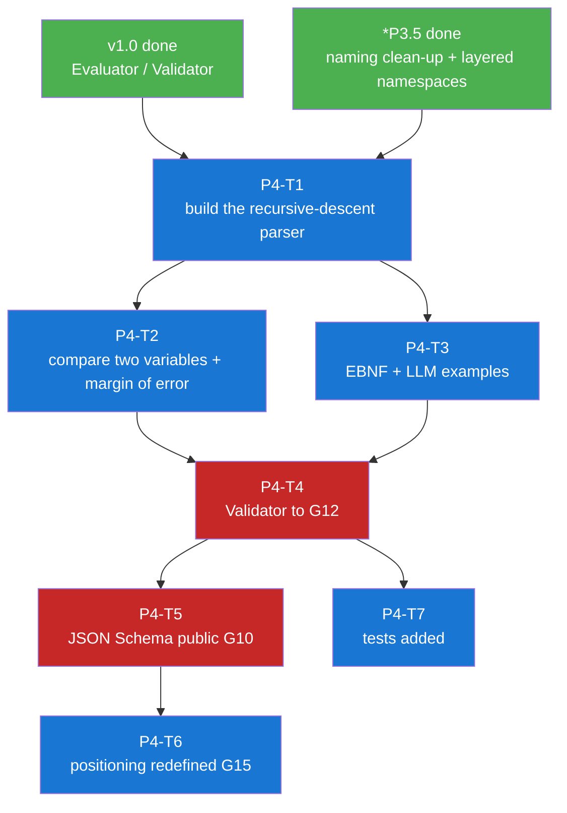
```mermaid
graph TD
    V1[v1.0 done<br/>Evaluator / Validator]
    P35[*P3.5 done<br/>naming clean-up + layered namespaces]

    V1 --> P4T1[P4-T1<br/>build the recursive-descent parser]
    P35 --> P4T1
    P4T1 --> P4T2[P4-T2<br/>compare two variables + margin of error]
    P4T1 --> P4T3[P4-T3<br/>EBNF + LLM examples]
    P4T2 --> P4T4[P4-T4<br/>Validator to G12]
    P4T3 --> P4T4
    P4T4 --> P4T5[P4-T5<br/>JSON Schema public G10]
    P4T5 --> P4T6[P4-T6<br/>positioning redefined G15]
    P4T4 --> P4T7[P4-T7<br/>tests added]

    style V1 fill:#4caf50,color:#fff
    style P35 fill:#4caf50,color:#fff
    style P4T1 fill:#1976d2,color:#fff
    style P4T2 fill:#1976d2,color:#fff
    style P4T3 fill:#1976d2,color:#fff
    style P4T4 fill:#c62828,color:#fff
    style P4T5 fill:#c62828,color:#fff
    style P4T6 fill:#1976d2,color:#fff
    style P4T7 fill:#1976d2,color:#fff
```

---

### 5.3 P4-T1: turn Evaluator into a recursive-descent parser

#### Aim (P4-T1)

`Evaluator.Evaluate(string condition, State state)` now stands on a plain `string.Split`, and cannot handle AND/OR/NOT, brackets, precedence, or loose spacing. Swap this for a **recursive-descent parser**.

#### EBNF spec

```text
expression  ::= or_expr
or_expr     ::= and_expr ( "||" and_expr )*
and_expr    ::= unary_expr ( "&&" unary_expr )*
unary_expr  ::= "!" unary_expr | primary
primary     ::= "(" expression ")" | comparison | accessor
comparison  ::= accessor OP literal_or_accessor
accessor    ::= ("flags" | "counters" | "inventory") "." IDENT
literal_or_accessor ::= NUMBER | BOOL | accessor
OP          ::= "==" | "!=" | ">" | "<" | ">=" | "<="
IDENT       ::= [a-zA-Z_][a-zA-Z_0-9]*
NUMBER      ::= [0-9]+ ("." [0-9]+)?
BOOL        ::= "true" | "false"
```

The `accessor` words `flags`/`counters`/`inventory` **match the `State` property names, letter for letter**. This must follow from the Naming-Layer Theorem, G17.

#### New files (P4-T1)

| File | namespace | Role |
| --- | --- | --- |
| `Scripts/Core/ExprAst.cs` | `Germio.Core` | AST node types (`AndNode`, `OrNode`, `NotNode`, `ComparisonNode`, `AccessorNode`, `LiteralNode`) |
| `Scripts/Core/ExprLexer.cs` | `Germio.Core` | breaks text into tokens (`Tokenize(string source) → List<Token>`) |
| `Scripts/Core/ExprParser.cs` | `Germio.Core` | builds the parse tree (`Parse(List<Token>) → ExprAst`) |

#### Files changed (P4-T1)

| File | Change |
| --- | --- |
| `Scripts/Core/Evaluator.cs` | swap `Evaluate(string condition, State state)` for a build that runs through the AST. Keep the rule that an empty string or null gives `true` |

#### Build sketch (P4-T1)

```csharp
// ExprAst.cs
namespace Germio.Core {
    public abstract class ExprAst {
        public abstract bool Evaluate(State state);
    }
    public class AndNode : ExprAst { /* ... */ }
    public class OrNode : ExprAst { /* ... */ }
    public class NotNode : ExprAst { /* ... */ }
    public class ComparisonNode : ExprAst { /* ... */ }
    public class AccessorNode : ExprAst { /* ... */ }
    public class LiteralNode : ExprAst { /* ... */ }
}

// Evaluator.cs (after the change)
using Germio.Model;
namespace Germio.Core {
    public static class Evaluator {
        public static bool Evaluate(string? condition, State state) {
            if (string.IsNullOrWhiteSpace(condition)) { return true; }
            var tokens = ExprLexer.Tokenize(condition);
            var ast = ExprParser.Parse(tokens);
            return ast.Evaluate(state);
        }
    }
}
```

#### Design choices to mind, from the LLM's side

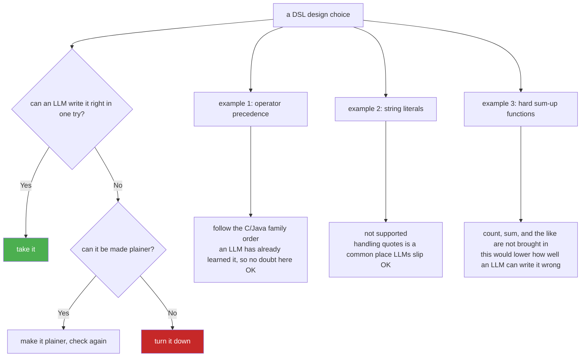
```mermaid
flowchart TD
    A[a DSL design choice] --> B1{can an LLM write it right in one try?}
    B1 -->|Yes| OK[take it]
    B1 -->|No| B2{can it be made plainer?}
    B2 -->|Yes| SIMPLIFY[make it plainer, check again]
    B2 -->|No| REJECT[turn it down]

    A --> C1[example 1: operator precedence]
    C1 --> C1A[follow the C/Java family order<br/>an LLM has already learned it, so no doubt here OK]

    A --> C2[example 2: string literals]
    C2 --> C2A[not supported<br/>handling quotes is a common place LLMs slip OK]

    A --> C3[example 3: hard sum-up functions]
    C3 --> C3A[count, sum, and the like are not brought in<br/>this would lower how well an LLM can write it wrong]

    style OK fill:#4caf50,color:#fff
    style REJECT fill:#c62828,color:#fff
```

#### DoD (Definition of Done)

+ [x] `ExprLexer.cs`, `ExprParser.cs`, and `ExprAst.cs` are newly built, under the `Germio.Core` namespace
+ [x] `Evaluator.Evaluate` runs through the AST
+ [x] every test already in `EvaluatorTests.cs` (empty string, `flags.x`, `counters.y > 0`, and the rest) is GREEN
+ [x] a new `ExprParserTests.cs` covers AND/OR/NOT, brackets, and precedence (at least 30 cases)
+ [x] a parse error throws `ExprParseException` (new), holding where it went wrong (the column)
+ [x] every `dotnet test` is GREEN

#### Test needs

```csharp
// example: ExprParserTests.cs
[Test] public void And_BothTrue_ReturnsTrue() { /* flags.a && flags.b */ }
[Test] public void Or_OneTrue_ReturnsTrue() { /* flags.a || flags.b */ }
[Test] public void Not_True_ReturnsFalse() { /* !flags.a */ }
[Test] public void Precedence_AndBeforeOr() { /* flags.a || flags.b && flags.c */ }
[Test] public void Parens_OverridePrecedence() { /* (flags.a || flags.b) && flags.c */ }
[Test] public void VariableComparison_CountersGreater() { /* counters.score > counters.high */ }
[Test] public void RelativeEpsilon_Float() { /* counters.x == 0.1 + 0.2 (G4) */ }
[Test] public void ParseError_UnclosedParen_Throws() { /* (flags.a */ }
// ... at least 30 in all
```

---

### 5.4 P4-T2: compare two variables + margin of error (G4)

#### Aim (P4-T2)

Right now, a comparison can only be "accessor OP a literal value". There is no way to write a **comparison between two variables**, such as `counters.score > counters.high_score`. On top of that, use a **margin of error** for `==`, so a floating-point comparison does not break down when the numbers get large.

#### Files changed (P4-T2)

| File | Change |
| --- | --- |
| `Scripts/Core/ExprAst.cs` (built in T1) | widen `ComparisonNode`'s right side to take an `ExprAst` (either an `AccessorNode` or a `LiteralNode`) |
| `Scripts/Core/Evaluator.cs` | change how `==` is checked, to a margin-of-error base: `abs(a-b) <= eps * max(abs(a), abs(b), 1.0)`, with `eps = 1e-6` |

#### Build sketch (P4-T2)

```csharp
// ComparisonNode.cs
public override bool Evaluate(State state) {
    double left = leftAccessor.GetNumeric(state);
    double right = rightExpr.GetNumeric(state);  // an AccessorNode or a LiteralNode

    return op switch {
        "==" => Math.Abs(left - right) <= 1e-6 * Math.Max(Math.Max(Math.Abs(left), Math.Abs(right)), 1.0),
        "!=" => !(Math.Abs(left - right) <= 1e-6 * Math.Max(Math.Max(Math.Abs(left), Math.Abs(right)), 1.0)),
        ">"  => left > right,
        "<"  => left < right,
        ">=" => left >= right,
        "<=" => left <= right,
        _ => throw new InvalidOperationException($"Unknown operator: {op}")
    };
}
```

#### DoD (P4-T2)

+ [x] a comparison between two variables, such as `counters.a > counters.b`, can be parsed and checked
+ [x] `counters.score == counters.threshold` gives true when it sits within a margin of error of 1e-6
+ [x] a large-number case (`1e15 == 1e15 + 1`) gives true (with a plain margin it would give false, but with a relative one it gives true)
+ [x] a new `EvaluatorAdvancedTests.cs` covers 10 cases of comparing two variables, and 5 cases at the edge of the margin of error
+ [x] every `dotnet test` is GREEN

---

### 5.5 P4-T3: the EBNF spec document + a set of examples for an LLM

#### Aim (P4-T3)

Let an LLM write the DSL right after only reading a prompt. **The EBNF alone does not give an LLM good output**, so a set of examples must always sit beside it.

#### New files (P4-T3)

| File | Role |
| --- | --- |
| `docs/dsl_spec.md` | the EBNF, plus what each part does (each operator, accessor, and precedence) |
| `docs/dsl_cookbook.md` | a set of patterns for an LLM (in P5.5, the content of `germio_dsl_examples.md` is moved here and grown) |

#### The DSL examples in `dsl_cookbook.md` (matches P4-T3)

The patterns for DSL condition strings sit in `docs/dsl_cookbook.md` Section 6 (Failure Patterns), and in the `condition` field of each section. It holds over 30 working examples.

#### DoD (P4-T3)

+ [x] `docs/dsl_spec.md` holds the full EBNF, plus what each part of the grammar does
+ [x] `docs/dsl_cookbook.md` holds 30+ working examples (condition-string patterns)
+ [x] at least 5 anti-patterns (mistakes an LLM tends to make) are set out plainly (Cookbook §6)
+ [x] every example in the documents can be parsed and checked for real by `Evaluator.Evaluate` (checking this on its own through CI is a good idea)

---

### 5.6 P4-T4: bring the Validator up to G12 (an error that fixes itself)

#### Aim (P4-T4)

Right now, `ValidationResult` only holds `level`/`ruleId`/`message` — not enough for an LLM to fix from. Widen it to the three-part form: **where + why + a fix**.

#### Files changed (P4-T4)

| File | Change |
| --- | --- |
| `Scripts/Core/Validator.cs` | widen the `ValidationResult` shape; add a new `Location` type |

#### The new shape

```csharp
namespace Germio.Core {
    public class ValidationResult {
        public ValidationLevel severity { get; set; }
        public string rule_id { get; set; } = "";
        public Location location { get; set; } = new();
        public string message { get; set; } = "";
        public string cause_detail { get; set; } = "";
        public string fix_suggestion { get; set; } = "";
        public string suggested_json { get; set; } = "";

        public string ToLlmReadable() {
            return $@"[{severity}] {rule_id}
  where: {location.json_path} (line {location.line}, col {location.column})
  why: {cause_detail}
  fix: {fix_suggestion}
  suggested JSON: {suggested_json}";
        }
    }
}
```

#### An error output for an LLM to read

```text
[Error] V001
  where: $.worlds[0].levels[2].next[0].condition (line 45, col 23)
  why: the flag 'boss_def_eated' does not exist in state.flags' starting values. a close, real key: 'boss_defeated'
  fix: this looks like a typing slip. change it to 'boss_defeated'
  suggested JSON: { ..., "condition": "flags.boss_defeated" }
```

#### Rules the Validator should give out (at least 12)

| ID | Level | What it catches |
| --- | --- | --- |
| V001 | Error | a `flags` key used that was never set (with a close-word hint) |
| V002 | Error | a `counters` key used that was never set (with a close-word hint) |
| V003 | Error | an `inventory` key used that was never set (with a close-word hint) |
| V004 | Error | two levels share the same `level.id` |
| V005 | Error | two rules share the same `rule.id` |
| V006 | Error | a `Next.id` points to a level that does not exist |
| V007 | Warning | a `rule.condition` is empty (fires every time) |
| V008 | Warning | `once=false` while the `command` is `set_flag` (a chance of an endless loop) |
| V009 | Error | a DSL parse error (built in T1, caught here) |
| V010 | Error | `command` is null (a Rule needs a `command`) |
| V011 | Warning | a level has no `rules` and no `next` (a dead end) |
| V012 | Error | a loop found in transitions (the Next graph holds a strongly-connected part) |

#### DoD (P4-T4)

+ [x] `ValidationResult` is widened to the new shape (`location`, `cause_detail`, `fix_suggestion`, `suggested_json`, `ToLlmReadable()`)
+ [x] every Validator test already there (the V001-V003 family) is GREEN
+ [x] a new `ValidatorLlmFormatTests.cs` covers all 12 rules, checking the error-string shape for each
+ [x] V012 (a loop in transitions) is found with a DFS search, and the loop's own path is put in `cause_detail`
+ [x] every `dotnet test` is GREEN

---

### 5.7 P4-T5: make the JSON Schema public (G10) — *the most important task

#### Aim (P4-T5)

Build a JSON Schema (Draft 2020-12) on its own from every class in `Germio.Model`, and put it out as `schemas/germio.schema.json`. This becomes **the public API baked into an LLM's prompt**.

#### An important base fact

Now that P3.5 (the refactor) is done, every name the Schema prints under `$defs` is **already tuned to fit an LLM, in full**:

```text
v2.1 form (old)  | v2.2 form (new)
DataRoot         | Scenario
DataState        | State
DataLevel        | Level
DataAction       | Command
DataEvent        | Rule
setFlag          | set_flag
firedEvents      | fired_rules
```

→ **This risk is gone, thanks to P3.5.** There is no reason left to hold back on making the Schema public.

#### A new package needed

```bash
cd game
dotnet add package NJsonSchema --version 11.0.2  # or the latest
```

#### New files (P4-T5)

| File | namespace | Role |
| --- | --- | --- |
| `Scripts/Schema/SchemaExporter.cs` | `Germio.Schema` | calls NJsonSchema to build the Schema |
| `Scripts/Editor/SchemaExportMenu.cs` | `Germio.Editor` | the Unity Editor menu item (`Tools > Germio > Export Schema`) |
| `schemas/germio.schema.json` | (built output) | goes into the commit |

#### Build sketch (P4-T5)

```csharp
// SchemaExporter.cs
using NJsonSchema;
using NJsonSchema.Generation;
using Germio.Model;

namespace Germio.Schema {
    public static class SchemaExporter {
        public static async Task<string> Export() {
            var settings = new JsonSchemaGeneratorSettings {
                SchemaType = SchemaType.JsonSchema,  // near enough to Draft 2020-12
                SerializerSettings = Storage.JsonSettings,  // share the Newtonsoft settings
                FlattenInheritanceHierarchy = false,
            };
            var schema = JsonSchema.FromType<Scenario>(settings);
            schema.Title = "Germio Scenario Configuration";
            schema.Id = "https://germio.dev/schemas/germio.schema.json";
            return schema.ToJson();
        }
    }
}
```

#### The shape `germio.schema.json` should have

```json
{
  "$schema": "https://json-schema.org/draft/2020-12/schema",
  "$id": "https://germio.dev/schemas/germio.schema.json",
  "title": "Germio Scenario Configuration",
  "type": "object",
  "$defs": {
    "Scenario": { ... },
    "State": {
      "type": "object",
      "properties": {
        "flags": { ... },
        "counters": { ... },
        "inventory": { ... },
        "current_scene": { "type": "string" },
        "current_team": { "type": "string" },
        "fired_rules": { "type": "array", "items": { "type": "string" } }
      }
    },
    "World": { ... },
    "Level": { ... },
    "Next": { ... },
    "Rule": { ... },
    "Command": {
      "type": "object",
      "properties": {
        "set_flag": { "$ref": "#/$defs/SetFlag" },
        "update_counter": { "$ref": "#/$defs/UpdateCounter" },
        "update_inventory": { "$ref": "#/$defs/UpdateInventory" },
        "request_transition": { "type": ["string", "null"] }
      }
    },
    "SetFlag": { ... },
    "UpdateCounter": { ... },
    "UpdateInventory": { ... },
    "CounterOp": { "enum": ["set", "add", "sub"] }
  }
}
```

#### The Schema feedback loop

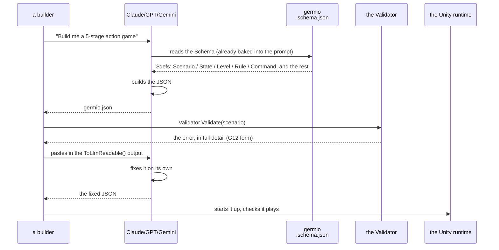
```mermaid
sequenceDiagram
    participant USER as a builder
    participant LLM as Claude/GPT/Gemini
    participant SCHEMA as germio<br/>.schema.json
    participant VAL as the Validator
    participant GAME as the Unity runtime

    USER->>LLM: "Build me a 5-stage action game"
    LLM->>SCHEMA: reads the Schema (already baked into the prompt)
    SCHEMA-->>LLM: $defs: Scenario / State / Level / Rule / Command, and the rest
    LLM->>LLM: builds the JSON
    LLM-->>USER: germio.json
    USER->>VAL: Validator.Validate(scenario)
    VAL-->>USER: the error, in full detail (G12 form)
    USER->>LLM: pastes in the ToLlmReadable() output
    LLM->>LLM: fixes it on its own
    LLM-->>USER: the fixed JSON
    USER->>GAME: starts it up, checks it plays
```

#### DoD (P4-T5)

+ [x] the `NJsonSchema` package is added to the `game/` project
+ [x] `Scripts/Schema/SchemaExporter.cs` is built, under the `Germio.Schema` namespace
+ [x] `Scripts/Editor/SchemaExportMenu.cs` gives the Unity menu item `Tools > Germio > Export Schema`
+ [x] `schemas/germio.schema.json` is built and goes into the commit
+ [x] the Schema output holds **not one old name (`DataRoot`, and the rest)** anywhere (checked with grep)
+ [x] the Schema's `$defs` keys match the **new names in §3.1's table, letter for letter**
+ [x] a new `SchemaExportTests.cs` checks:
  + the Schema output is a valid JSON Schema
  + every needed type is present under `$defs`
  + snake_case keys such as `current_scene`, `fired_rules`, `set_flag` turn up inside the Schema
  + old names such as `events`, `firedEvents`, `setFlag` **never turn up**
+ [x] every `dotnet test` is GREEN

---

### 5.8 P4-T6: redefine positioning (G15)

#### Aim (P4-T6)

Bring the wording across the repository — README, the Dashboard header, the GitHub repo description — in line with **"LLM-Native"**.

#### Before (v1.0 wording, as it stands now)

> "Make 3D models and levels (scenes) in a DCC tool such as Blender, then simply write the game's flow, layout, branches, and events in JSON (or Mermaid), and a real 3D game can be made with no coding at all."

#### After (v2.2 wording, the change)

> **Germio: The LLM-Native Game Progression Framework for Unity**
>
> Write Unity game flow not in JSON easy for a human, but in **JSON easy for an LLM**.
> Four ideas (`State` / `Rule` / `Command` / `Next`), declarative, a public JSON Schema, static checking built in, two-way Mermaid conversion, **snake_case, so C# property names and JSON keys match, letter for letter**.
> A base for a new way of working: building a game while talking it through with Claude, GPT, or Gemini.

#### What gets rewritten

| File | What changes |
| --- | --- |
| `README.md` | change the headline to LLM-Native; write the four ideas under their new names (Rule/Command) |
| `Germio_Overview_JP.md` | a full rewrite; Section 1 (the summary) rewritten with v2.2 wording |
| `Scripts/Editor/Dashboard.cs` | change the header comment from "data-driven" to "LLM-Native" |
| the GitHub repo description | from "Data-driven Unity game progression" to "LLM-Native Unity game progression framework" |
| the GitHub repo topics | add `llm`, `claude`, `gpt`, `gemini`, `json-schema`, `unity`, `game-development`, `state-machine`, `dsl` |
| the official site's landing page (later) | the same as above |
| `docs/llm_design_spec.md` (new) | sets out every rule from G9 through G18 |
| `docs/naming_spec.md` (*new) | sets out G17 (the Naming-Layer Theorem) and G18 (Layered Namespace) |

#### DoD (P4-T6)

+ [x] all 8 rewrites listed above are done
+ [x] `docs/llm_design_spec.md` and `docs/naming_spec.md` are newly built, setting out G9 through G18 in full
+ [x] a grep for the old Japanese phrase for "data-driven game progression FW" turns up **zero** hits (no old wording left)
+ [x] a grep for "LLM-Native" **always** turns up in the README, Dashboard, and Overview

---

### 5.9 P4-T7: Evaluator, extra tests

#### Aim (P4-T7)

Cover the **edge cases and error paths** for the DSL power added in P4-T1 and T2.

#### New or grown test files

| File | Content |
| --- | --- |
| `tests/Core/EvaluatorAdvancedTests.cs` (new) | comparing two variables, the margin of error, edge cases, large numbers, and floating-point extremes (NaN, Infinity) |
| `tests/Core/ExprParserTests.cs` (new) | the 30+ cases called for in T1's DoD |
| `tests/Core/ValidatorLlmFormatTests.cs` (new) | the 12 rules called for in T4's DoD |

#### DoD (P4-T7)

+ [x] the 3 files above are newly built
+ [x] the test count grows from 154 to **200+**
+ [x] every `dotnet test` is GREEN
+ [x] (not required) measuring coverage: Evaluator/ExprParser/Validator at 95% or above

---

## 6. Phase 5: hardening + the LLM link-up layer (October-December 2026)

### 6.1 Aim of Phase 5

> On top of the hardening of security and data soundness planned in v2.0, **build the link-up layer that lets an LLM use Germio "as a tool"**. In full, this reaches as far as two-way Mermaid conversion, setting up system prompts for an LLM, and looking into building an MCP (Model Context Protocol) server.

### 6.2 Task dependency graph

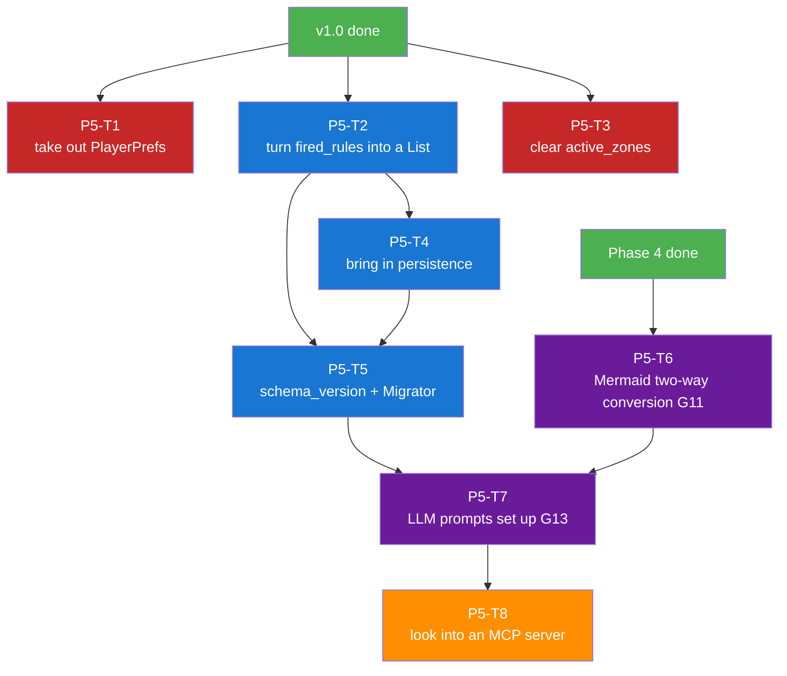
```mermaid
graph TD
    V1[v1.0 done] --> P5T1[P5-T1<br/>take out PlayerPrefs]
    V1 --> P5T2[P5-T2<br/>turn fired_rules into a List]
    V1 --> P5T3[P5-T3<br/>clear active_zones]
    P5T2 --> P5T4[P5-T4<br/>bring in persistence]
    P5T2 --> P5T5[P5-T5<br/>schema_version + Migrator]
    P5T4 --> P5T5
    P4DONE[Phase 4 done] --> P5T6[P5-T6<br/>Mermaid two-way conversion G11]
    P5T5 --> P5T7[P5-T7<br/>LLM prompts set up G13]
    P5T6 --> P5T7
    P5T7 --> P5T8[P5-T8<br/>look into an MCP server]

    style V1 fill:#4caf50,color:#fff
    style P4DONE fill:#4caf50,color:#fff
    style P5T1 fill:#c62828,color:#fff
    style P5T2 fill:#1976d2,color:#fff
    style P5T3 fill:#c62828,color:#fff
    style P5T4 fill:#1976d2,color:#fff
    style P5T5 fill:#1976d2,color:#fff
    style P5T6 fill:#6A1B9A,color:#fff
    style P5T7 fill:#6A1B9A,color:#fff
    style P5T8 fill:#FF8F00,color:#fff
```

---

### 6.3 P5-T1: take out the PlayerPrefs key fallback (G6)

#### Aim (P5-T1)

Take out the fallback that stores the save-data encryption key as plain text in `PlayerPrefs`. Use the **OS's own secure store** instead (Windows: DPAPI, macOS: Keychain, Linux: libsecret).

#### Changes (P5-T1)

| File | Change |
| --- | --- |
| `Scripts/Core/Vault.cs` | take out every `PlayerPrefs.GetString/SetString` call in full. Swap for the OS secure store, or a key typed in by the user and turned into one with encryption |

#### Build plan

+ **First choice**: use the OS key store (DPAPI / Keychain / libsecret) through P/Invoke
+ **Second choice**: at start-up, ask the user for a passphrase → build the key with PBKDF2 → keep it only in memory
+ **Not allowed**: storing it as plain text on disk, or using `PlayerPrefs`

#### DoD (P5-T1)

+ [x] every `PlayerPrefs` call is fully gone from `Vault.cs` (a grep turns up zero)
+ [x] every test already in `VaultTests.cs` is GREEN
+ [x] a new test checks that "the only place the key lives outside memory is the OS's secure store"
+ [x] checked (in CI) that it runs on Linux with no fallback
+ [x] every `dotnet test` is GREEN

---

### 6.4 P5-T2: make sure fired_rules keeps its order (G5)

#### Aim (P5-T2)

Right now, `State.fired_rules` is a `HashSet<string>`, and **its order is not held**. Change it to a `List<string>` so the order things were added is kept — needed for comparing save-data diffs, checking an LLM's own diffs, and making a run repeat the same way.

#### Changes (P5-T2)

| File | Change |
| --- | --- |
| `Scripts/Model/Data.cs` | change the type of `State.fired_rules` from `HashSet<string>` to `List<string>` |
| `Scripts/Core/Store.cs` | keep `_scenario.state.fired_rules.Contains(rule.id)` and `.Add(rule.id)` inside `Dispatch` (a List gives the same API behavior) |
| `Scripts/Core/Storage.cs` | (no change; Newtonsoft.Json handles a List or a HashSet the same way, without needing to know which) |
| existing JSON fixtures | where `fired_rules`'s value is already an array, keep it as is. Newtonsoft handles turning a set form into a list form |

#### DoD (P5-T2)

+ [x] `State.fired_rules`'s type is `List<string>` (its order is held)
+ [x] inside `Store.Dispatch`, a guard stops the same id being added twice (`if (!list.Contains(id)) list.Add(id);`)
+ [x] tests already there (StorageTests, StoreTests) are GREEN
+ [x] a new test checks that "the order rules were added matches the list's own order"
+ [x] every `dotnet test` is GREEN

---

### 6.5 P5-T3: clear active_zones

#### Aim (P5-T3)

Fix a hidden bug where `Bus._active_zones` is not cleared on a scene change, leaving the last scene's Zone IDs behind.

#### Changes (P5-T3)

| File | Change |
| --- | --- |
| `Scripts/Systems/Bus.cs` | add a `public void ClearActiveZones()` method |
| `Scripts/Systems/SceneLoader.cs` | call `bus.ClearActiveZones()` once a scene load is done |
| `Scripts/Core/Store.cs` | once `RequestTransition` is done, clear it through a reference to `Bus` (or through an event) |

#### Build sketch (P5-T3)

```csharp
// Bus.cs
public void ClearActiveZones() {
    _active_zones.Clear();
}

// SceneLoader.cs
private void OnSceneLoaded() {
    _bus.ClearActiveZones();
    // ...
}
```

#### DoD (P5-T3)

+ [x] `Bus.ClearActiveZones()` is added, and a test checks it clears
+ [x] checked that it is called through SceneLoader on a scene change
+ [x] every `dotnet test` is GREEN

---

### 6.6 P5-T4: bring in persistence

#### Aim (P5-T4)

Right now, `State.fired_rules` saves the full history of every `once`-flagged fire, but **state that should stay forever is a different idea** — such as a character already unlocked, or an achievement already earned. Split these out into a new property, `State.persistence`.

#### Changes (P5-T4)

| File | Change |
| --- | --- |
| `Scripts/Model/Data.cs` | add `Dictionary<string, object> persistence { get; set; }` to `State` |
| `Scripts/Core/Executor.cs` | add a branch that handles `set_persistence` (a new type, `SetPersistence`, added to `Command`) |

#### New type

```csharp
namespace Germio.Model {
    public class SetPersistence {
        public string key { get; set; } = "";
        public object value { get; set; } = null!;
    }
}
```

#### The update to `Command`

```csharp
public class Command {
    public SetFlag? set_flag { get; set; }
    public UpdateCounter? update_counter { get; set; }
    public UpdateInventory? update_inventory { get; set; }
    public string? request_transition { get; set; }
    public SetPersistence? set_persistence { get; set; }  // *added
}
```

#### DoD (P5-T4)

+ [x] the `State.persistence` property is added (snake_case, kept as `persistence` in the JSON too)
+ [x] `Command.set_persistence` works (applied by the Executor)
+ [x] a new test checks persistence being kept, brought back, and round-tripped through JSON
+ [x] every `dotnet test` is GREEN

---

### 6.7 P5-T5: schema_version + Migrator

#### Aim (P5-T5)

To keep save data and config **working across versions**, give each file a `schema_version` at the top, and bring in `Migrator.cs`, which turns an old version into the newest one on its own.

#### Changes (P5-T5)

| File | Change |
| --- | --- |
| `Scripts/Model/Data.cs` | add `int schema_version { get; set; } = 1;` to `Scenario` |
| `Scripts/Core/Migrator.cs` (new) | `Migrate(JObject json) → JObject`, turning an old version into the newest one |
| `Scripts/Core/Storage.cs` | run `Migrator.Migrate` right after `LoadAsync` reads a file in |

#### Build sketch (P5-T5)

```csharp
namespace Germio.Core {
    public static class Migrator {
        public const int CURRENT_VERSION = 1;

        public static JObject Migrate(JObject json) {
            int version = json["schema_version"]?.Value<int>() ?? 0;
            while (version < CURRENT_VERSION) {
                json = MigrateStep(json, version);
                version++;
            }
            json["schema_version"] = CURRENT_VERSION;
            return json;
        }

        private static JObject MigrateStep(JObject json, int from_version) {
            return from_version switch {
                0 => MigrateV0ToV1(json),
                _ => json
            };
        }

        private static JObject MigrateV0ToV1(JObject json) {
            // example: old firedEvents -> fired_rules, old events -> rules, and the rest
            // a compatibility shim for loading save data from before the P3.5 refactor
            return json;
        }
    }
}
```

#### DoD (P5-T5)

+ [x] the `Scenario.schema_version` property is added (default 1)
+ [x] `Migrator.cs` is newly built, with at least one migration step (V0 → V1)
+ [x] checked that JSON in the old form (naming from before the refactor) is migrated on its own when read in
+ [x] a new `MigratorTests.cs` covers the old-to-new conversion in full
+ [x] every `dotnet test` is GREEN

---

### 6.8 P5-T6: Mermaid two-way conversion (G11)

#### Aim (P5-T6)

Right now, only `Grapher.Export(Scenario) → string (Mermaid)` is built. Newly build the **other direction, `MermaidParser.Parse(string) → Scenario`**, so JSON and Mermaid can round-trip into each other.

#### What two-way conversion means for LLM-driven work

```mermaid
flowchart TD
    A[a human / an LLM] -->|edits the JSON| B[germio.json]
    B -->|Grapher.Export| C[a Mermaid picture]
    C -->|*MermaidParser.Parse| B

    D[a human / an LLM] -->|edits the Mermaid| C

    B -.an LLM's context.-> E[an LLM can go back and forth<br/>between JSON and Mermaid freely]
    C -.an LLM's context.-> E

    E --> F[*a way of working — "think in pictures,<br/>build in JSON" — now stands, for an LLM]

    style C fill:#1976d2,color:#fff
    style E fill:#1976d2,color:#fff
    style F fill:#4caf50,color:#fff
```

#### New file (P5-T6)

| File | namespace | Role |
| --- | --- | --- |
| `Scripts/Core/MermaidParser.cs` | `Germio.Core` | `Parse(string mermaid) → Scenario` |

#### Class design

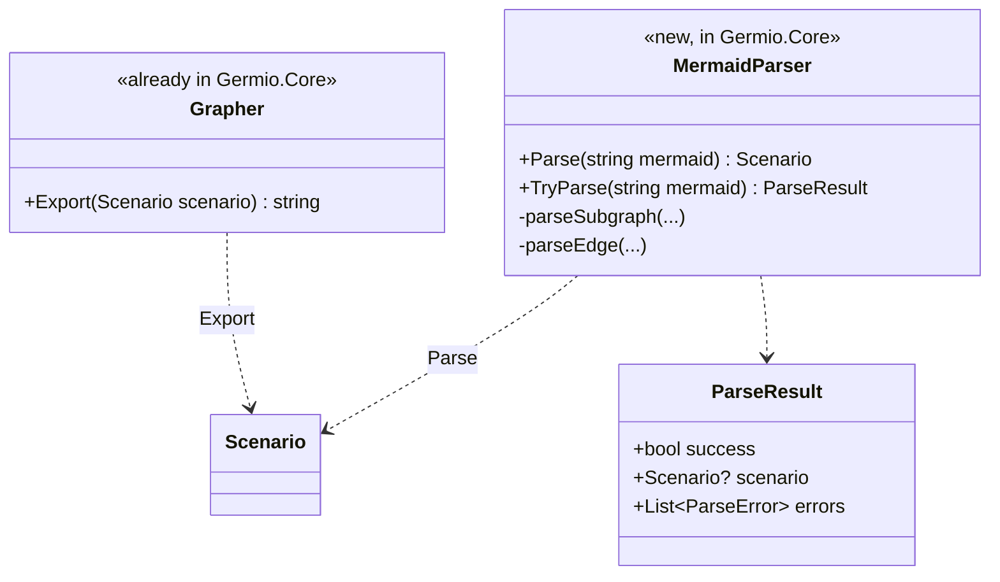
```mermaid
classDiagram
    class Grapher {
        <<already in Germio.Core>>
        +Export(Scenario scenario) string
    }

    class MermaidParser {
        <<new, in Germio.Core>>
        +Parse(string mermaid) Scenario
        +TryParse(string mermaid) ParseResult
        -parseSubgraph(...)
        -parseEdge(...)
    }

    class ParseResult {
        +bool success
        +Scenario? scenario
        +List~ParseError~ errors
    }

    Grapher ..> Scenario : Export
    MermaidParser ..> ParseResult
    MermaidParser ..> Scenario : Parse
```

#### Round-trip needs

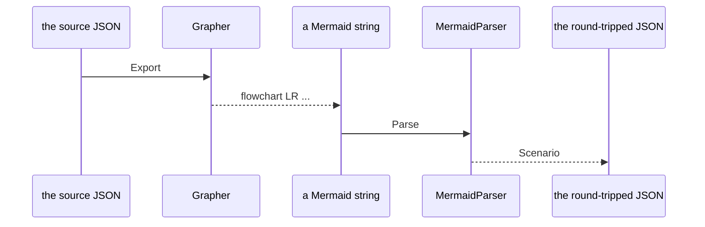
```mermaid
sequenceDiagram
    participant ORIG as the source JSON
    participant G as Grapher
    participant MD as a Mermaid string
    participant P as MermaidParser
    participant ROUND as the round-tripped JSON

    ORIG->>G: Export
    G-->>MD: flowchart LR ...
    MD->>P: Parse
    P-->>ROUND: Scenario
```

The round-tripped JSON must hold the same meaning as the source. Field-for-field byte match is not called for (comment order and the like may shift), but every `id`, `condition`, and `command` must match.

#### DoD (P5-T6)

+ [x] `Scripts/Core/MermaidParser.cs` is newly built, under `Germio.Core`
+ [x] `Parse` and `TryParse` are both built
+ [x] a new `MermaidParserTests.cs` covers a round trip (`Export` then `Parse`, checking it matches the source)
+ [x] a broken Mermaid string gives a `ParseResult` with `success = false` and a filled `errors` list, rather than throwing
+ [x] every `dotnet test` is GREEN

---

### 6.9 P5-T7: set up LLM prompts (G13)

#### Aim (P5-T7)

Ship the `prompts/` folder as a first-class deliverable, holding the system prompts, task templates, and working examples an LLM needs to write correct Germio JSON.

#### Folder layout

```text
prompts/
├── CHANGELOG.md
├── system/
│   ├── claude_designer.md
│   ├── claude_quick.md
│   ├── gpt4_designer.md
│   ├── gpt4_quick.md
│   ├── gemini_designer.md
│   └── gemini_quick.md
├── tasks/
│   ├── add_level.md
│   ├── add_rule.md
│   ├── create_action_game.md
│   ├── create_adventure_game.md
│   ├── create_scenario.md
│   ├── fix_validation_error.md
│   ├── refactor_progression.md
│   └── validate_scenario.md
├── examples/
│   └── minimal_5stages.json
└── benchmark/
    └── golden_set.json
```

#### What every system prompt must state

```markdown
# (for Claude / GPT / Gemini) Germio Designer Prompt

## Your role
A designer laying out game flow with the Germio framework. Output is **JSON only**. Any words of explanation go on a separate channel.

## Naming rule (fixed, no exceptions)
- everything in snake_case (example: set_flag, fired_rules, current_scene)
- camelCase is not allowed (example: setFlag is wrong)
- no Japanese

## The four ideas
- **State**: the game's changing state (flags, counters, inventory, current_scene, current_team, fired_rules)
- **Rule**: an ECA rule (trigger + condition + command + once)
- **Command**: a change of state (set_flag, update_counter, update_inventory, request_transition)
- **Next**: a move from one Level to another (id + condition)

## JSON Schema
(the full text of germio.schema.json goes here)

## Common mistakes
1. setFlag (camelCase) — always write set_flag
2. flags.x == true — this is redundant; flags.x alone is enough
3. action: { ... } — not action, but command
4. events: [...] — not events, but rules
5. writing a string literal in a condition (such as 'cleared') — not supported

## An output example
(minimal_5stages.json goes here)
```

#### DoD (P5-T7)

+ [x] the `prompts/` folder is built in the layout above
+ [x] all 3 system prompts (claude/gpt4/gemini) are each 200+ lines
+ [x] `tasks/` holds at least 5 task templates
+ [x] `examples/` holds at least 3 finished JSON examples (`minimal_5stages.json`, and the rest)
+ [x] `benchmark/golden_set.json` is built ahead of time, even empty (filled in P7-T1)
+ [x] `CHANGELOG.md` exists, with a first entry

---

### 6.10 P5-T8: look into an MCP server (exploratory)

#### Aim (P5-T8)

Look into letting Claude Desktop / Claude Code edit, check, and run Germio JSON directly through Anthropic's **Model Context Protocol (MCP)**.

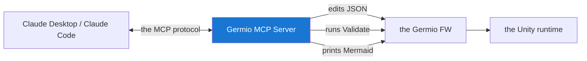
```mermaid
flowchart LR
    CLAUDE[Claude Desktop / Claude Code]
    MCP[Germio MCP Server]
    GERMIO[the Germio FW]
    UNITY[the Unity runtime]

    CLAUDE <-->|the MCP protocol| MCP
    MCP -->|edits JSON| GERMIO
    MCP -->|runs Validate| GERMIO
    MCP -->|prints Mermaid| GERMIO
    GERMIO --> UNITY

    style MCP fill:#1976d2,color:#fff
```

#### Tools to offer (the MCP API)

| Tool name | Role |
| --- | --- |
| `germio.load_scenario` | reads germio.json in, gives back a Scenario |
| `germio.save_scenario` | writes a Scenario out to germio.json |
| `germio.validate` | runs the Validator, gives back a list of ValidationResults |
| `germio.export_mermaid` | prints Mermaid, through Grapher |
| `germio.parse_mermaid` | turns Mermaid into a Scenario, through MermaidParser |
| `germio.evaluate_condition` | tries out a DSL condition string |

#### DoD (P5-T8)

+ [x] `Scripts/Editor/McpServerMenu.cs` is newly built (a menu for an optional feature)
+ [x] after reading the MCP protocol spec, a design for the 6 tools above is written in `docs/mcp_spec.md`
+ [x] the **build itself is set as an optional task for after the v1.0 release** (only the design is done in this phase)
+ [x] kept a clash with G14 (neutral across LLMs) to the least it can be (a way of using Germio with no MCP is kept, too)

---

## 7. Phase 6: LLM dogfood (December 2026-March 2027)

### 7.1 Aim of Phase 6

> In v2.0, the plan was "a human builds one game with Germio". In v2.1/v2.2, this turns into **"an LLM alone finishes one game with Germio"**. This is **a proof that puts the whole reason Germio exists on the line**.

### 7.2 The dogfooding strategy

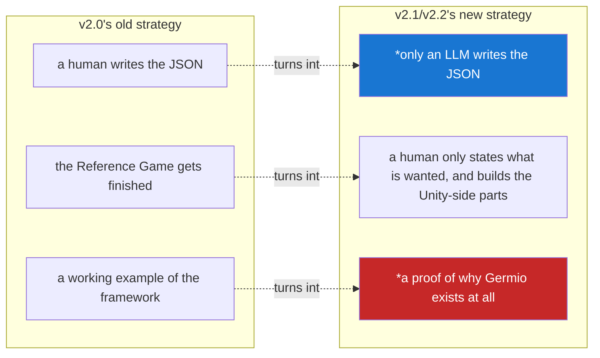
```mermaid
flowchart LR
    subgraph V20["v2.0's old strategy"]
        OLD1[a human writes the JSON]
        OLD2[the Reference Game gets finished]
        OLD3[a working example of the framework]
    end
    subgraph V22["v2.1/v2.2's new strategy"]
        NEW1[*only an LLM writes the JSON]
        NEW2[a human only states what is wanted, and builds the Unity-side parts]
        NEW3[*a proof of why Germio exists at all]
    end

    OLD1 -.turns into.-> NEW1
    OLD2 -.turns into.-> NEW2
    OLD3 -.turns into.-> NEW3

    style NEW1 fill:#1976d2,color:#fff
    style NEW3 fill:#c62828,color:#fff
```

### 7.3 Task layout

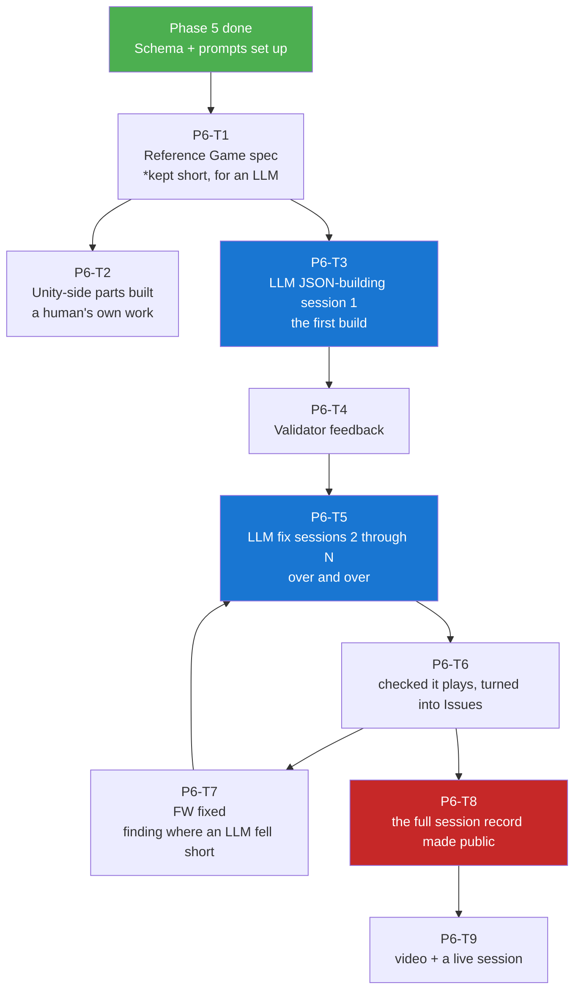
```mermaid
graph TD
    P5DONE[Phase 5 done<br/>Schema + prompts set up]
    P5DONE --> P6T1[P6-T1<br/>Reference Game spec<br/>*kept short, for an LLM]
    P6T1 --> P6T2[P6-T2<br/>Unity-side parts built<br/>a human's own work]
    P6T1 --> P6T3[P6-T3<br/>LLM JSON-building session 1<br/>the first build]
    P6T3 --> P6T4[P6-T4<br/>Validator feedback]
    P6T4 --> P6T5[P6-T5<br/>LLM fix sessions 2 through N<br/>over and over]
    P6T5 --> P6T6[P6-T6<br/>checked it plays, turned into Issues]
    P6T6 --> P6T7[P6-T7<br/>FW fixed<br/>finding where an LLM fell short]
    P6T7 --> P6T5
    P6T6 --> P6T8[P6-T8<br/>the full session record made public]
    P6T8 --> P6T9[P6-T9<br/>video + a live session]

    style P5DONE fill:#4caf50,color:#fff
    style P6T3 fill:#1976d2,color:#fff
    style P6T5 fill:#1976d2,color:#fff
    style P6T8 fill:#c62828,color:#fff
```

---

### 7.4 P6-T1: the Reference Game spec

#### Game name (working): `Germio Demo: Echoes of the Sprout`

#### How the spec is given (a human, to an LLM)

```text
"Build me a small action game in Germio, with 5 stages.
Each stage clears once every enemy is beaten and the goal is reached.
3 lives; game over once all are spent.
Up to 3 continues after a game over.
Clearing all 5 stages leads to the ending.
Following the JSON Schema (Scenario / State / Level / Rule / Command),
put out germio_demo_config.json."
```

That is all. **No picture, and no detailed state-transition chart, is put in the spec.** This tests whether the LLM can work it out and build it on its own.

#### DoD (P6-T1)

+ [ ] the spec above is put down as final, in `case_studies/sprout_quest/README.md`
+ [ ] the spec holds **no state-transition chart, no JSON example, and no C# code at all** (this is left for the LLM to build on its own)

---

### 7.5 P6-T2: build the Unity-side parts (a human's own work)

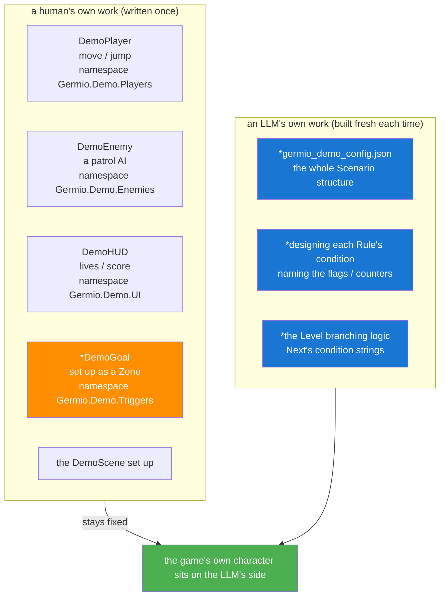
```mermaid
graph TB
    subgraph HUMAN["a human's own work (written once)"]
        H1[DemoPlayer<br/>move / jump<br/>namespace Germio.Demo.Players]
        H2[DemoEnemy<br/>a patrol AI<br/>namespace Germio.Demo.Enemies]
        H3[DemoHUD<br/>lives / score<br/>namespace Germio.Demo.UI]
        H4[*DemoGoal<br/>set up as a Zone<br/>namespace Germio.Demo.Triggers]
        H5[the DemoScene set up]
    end
    subgraph LLM["an LLM's own work (built fresh each time)"]
        L1[*germio_demo_config.json<br/>the whole Scenario structure]
        L2[*designing each Rule's condition<br/>naming the flags / counters]
        L3[*the Level branching logic<br/>Next's condition strings]
    end

    HUMAN -->|stays fixed| LLM_LAYER[the game's own character sits on the LLM's side]
    LLM --> LLM_LAYER

    style L1 fill:#1976d2,color:#fff
    style L2 fill:#1976d2,color:#fff
    style L3 fill:#1976d2,color:#fff
    style LLM_LAYER fill:#4caf50,color:#fff
    style H4 fill:#FF8F00,color:#fff
```

#### Naming rules (for the Unity-side parts)

| Part | namespace | Main dependency |
| --- | --- | --- |
| `DemoPlayer.cs` | `Germio.Demo.Players` | UnityEngine, Germio.Systems |
| `DemoEnemy.cs` | `Germio.Demo.Enemies` | UnityEngine |
| `DemoHUD.cs` | `Germio.Demo.UI` | UnityEngine.UI, Germio.Core (watches the Store) |
| `DemoGoal.cs` | `Germio.Demo.Triggers` | UnityEngine, Germio.Systems (calls `Bus.Publish` through a Zone) |

#### DoD (P6-T2)

+ [ ] the 4 parts above are built, under `game/Assets/Plugins/Germio/Demo/Scripts/`
+ [ ] each is written under its own `Germio.Demo.*` namespace
+ [ ] `DemoGoal` calls `Bus.Publish("zone_goal")` through a `Zone`
+ [ ] the DemoScene starts up and can be played (once an LLM builds a config for it, it can be played right away)

---

### 7.6 P6-T3 through T5: the LLM JSON-building session (over and over)

#### The whole session flow

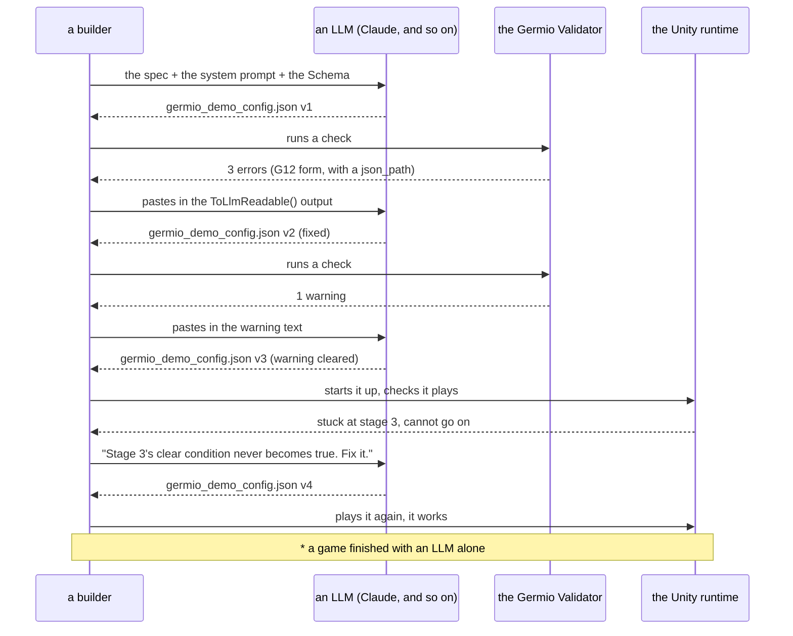
```mermaid
sequenceDiagram
    participant DEV as a builder
    participant LLM as an LLM (Claude, and so on)
    participant VAL as the Germio Validator
    participant UNITY as the Unity runtime

    DEV->>LLM: the spec + the system prompt + the Schema
    LLM-->>DEV: germio_demo_config.json v1
    DEV->>VAL: runs a check
    VAL-->>DEV: 3 errors (G12 form, with a json_path)
    DEV->>LLM: pastes in the ToLlmReadable() output
    LLM-->>DEV: germio_demo_config.json v2 (fixed)
    DEV->>VAL: runs a check
    VAL-->>DEV: 1 warning
    DEV->>LLM: pastes in the warning text
    LLM-->>DEV: germio_demo_config.json v3 (warning cleared)
    DEV->>UNITY: starts it up, checks it plays
    UNITY-->>DEV: stuck at stage 3, cannot go on
    DEV->>LLM: "Stage 3's clear condition never becomes true. Fix it."
    LLM-->>DEV: germio_demo_config.json v4
    DEV->>UNITY: plays it again, it works
    Note over DEV,UNITY: * a game finished with an LLM alone
```

#### Gathering the session record

```mermaid
flowchart LR
    A[each session] --> B[the whole exchange is saved]
    B --> C1[the prompt]
    B --> C2[the LLM's output]
    B --> C3[the Validator's result]
    B --> C4[how many fixes it took]
    B --> C5[how many tries, up to the final success]

    C1 --> D[the public repository<br/>case_studies/]
    C2 --> D
    C3 --> D
    C4 --> D
    C5 --> D

    D --> E[*a benchmark base<br/>for later phases]

    style D fill:#1976d2,color:#fff
    style E fill:#4caf50,color:#fff
```

#### DoD (P6-T3)

+ [ ] the session record is saved, in order, to `case_studies/sprout_quest/session_log.md`
+ [ ] the final `germio_demo_config.json` is saved to `case_studies/sprout_quest/final_germio_demo_config.json`
+ [ ] the LLM reaches a finished game, starting from nothing but the spec (all 5 stages can be cleared in Unity)
+ [ ] fixing took 5 rounds or fewer (the mark for the G16 release: under 3 is the goal)

---

### 7.7 P6-T6 through T7: turning findings into Issues, and fixing the FW

#### Bringing out the patterns an LLM tends to slip on

```mermaid
flowchart TD
    A[looking over the sessions] --> B{patterns in where the LLM went wrong}
    B --> P1["pattern 1:<br/>reads operator precedence wrong<br/>-> fix: add more examples to the docs"]
    B --> P2["pattern 2:<br/>misspells a flags name<br/>-> fix: strengthen the Validator's close-word hints"]
    B --> P3["pattern 3:<br/>picks once over persistence, wrongly<br/>-> fix: make persistence's default plainer"]
    B --> P4["pattern 4:<br/>builds a loop in a transition condition<br/>-> fix: strengthen Validator V012"]
    B --> P5["pattern 5:<br/>mixes up Mermaid output with JSON<br/>-> fix: split the two apart plainly in the prompt"]
    B --> P6["*pattern 6:<br/>hallucinates set_flag as setFlag<br/>-> fix: put the naming rule right at the top of the prompt"]

    style P1 fill:#FF8F00,color:#fff
    style P2 fill:#FF8F00,color:#fff
    style P3 fill:#FF8F00,color:#fff
    style P4 fill:#c62828,color:#fff
    style P5 fill:#FF8F00,color:#fff
    style P6 fill:#c62828,color:#fff
```

> **Important for v2.2**: since snake_case is rare for C# in an LLM's training data (it is more Pythonic), an LLM may hesitate between "true snake_case" and "the camelCase C# is used to". Stating right at the top of the prompt that **"every piece of Germio JSON is snake_case, with no exception"** puts this doubt to rest ahead of time.

#### DoD (P6-T6)

+ [ ] every problem found during the sessions is put down as a GitHub Issue (at least 5)
+ [ ] each Issue is tagged **"fixed on the FW side" or "fixed by a better prompt"**
+ [ ] FW-side fixes are added as new P5 tasks (or built right away)

---

### 7.8 P6-T8 through T9: making it public, and a live session

```mermaid
flowchart TD
    A[what came out of it] --> B1[GitHub: case_studies/sprout/]
    A --> B2[YouTube: a video of the live session]
    A --> B3[a blog post: "I built a Unity game with only an LLM"]
    A --> B4[a thread on X / Bluesky]

    B1 --> C[*put out as a case others can repeat]
    B2 --> D[*lets people watch an LLM work, in real time]
    B3 --> E[*a pitch to the technical community]
    B4 --> F[*an early community starts to form]

    style C fill:#4caf50,color:#fff
    style D fill:#4caf50,color:#fff
    style E fill:#4caf50,color:#fff
    style F fill:#4caf50,color:#fff
```

#### DoD (P6-T8)

+ [ ] `case_studies/sprout_quest/` is made public in full (README, session_log, config, video)
+ [ ] at least 1 live-session video on YouTube (10-30 minutes)
+ [ ] at least 1 blog post

---

## 8. Phase 7: multi-LLM benchmark (March-May 2027)

### 8.1 Aim of Phase 7

> Prove that Germio **does not lean on one LLM maker over another** (G14). Put a number on it: check that Claude, GPT-4o, and Gemini Pro all reach the same quality of output, through a benchmark.

### 8.2 Benchmark design

```mermaid
flowchart TD
    A[benchmark design] --> B[golden_set/]
    B --> B1[10 kinds of game spec]
    B1 --> B11["spec 1: a 5-stage action game"]
    B1 --> B12["spec 2: a branching adventure (3 routes)"]
    B1 --> B13["spec 3: a turn-based strategy game"]
    B1 --> B14["spec 4: a score-attack shoot-em-up"]
    B1 --> B15["..."]

    A --> C[what is scored]
    C --> C1[Validator pass rate<br/>the chance it passes in one try]
    C --> C2[how many fix rounds it takes<br/>the average round trips to a working build]
    C --> C3[how right its meaning is<br/>how close it holds to the spec's intent]
    C --> C4[how big the code is<br/>how little needless bulk it has]
    C --> C5[*how well it keeps the naming rule<br/>how low its snake_case slip rate is]

    A --> D[who is checked]
    D --> D1[Claude 4.7 Opus]
    D --> D2[Claude Sonnet 4.6]
    D --> D3[GPT-5]
    D --> D4[Gemini Pro 2.5]
    D --> D5[a local LLM (such as Llama 4)]

    style B fill:#1976d2,color:#fff
    style C fill:#FF8F00,color:#fff
    style C5 fill:#c62828,color:#fff
    style D fill:#6A1B9A,color:#fff
```

### 8.3 Building the benchmark runner

```text
benchmark/
├── golden_set/
│   ├── req_001_action.md             *spec 1: the written need
│   ├── req_002_adventure.md
│   └── ...
├── runners/
│   ├── claude_runner.py              *feeds the prompt to Claude, through its API
│   ├── gpt_runner.py                 *the same, for GPT
│   └── gemini_runner.py              *the same, for Gemini
└── results/
    └── 2027-04-results.md            *the scoring report
```

#### How a runner works

```python
# claude_runner.py (an example)
import anthropic, json, subprocess

def run_benchmark(req_file: str, model: str) -> dict:
    spec = open(req_file).read()
    system_prompt = open("prompts/system/claude_germio_designer.md").read()

    client = anthropic.Anthropic()
    response = client.messages.create(
        model=model,
        system=system_prompt,
        messages=[{"role": "user", "content": spec}],
        max_tokens=8000,
    )
    generated_json = extract_json(response.content[0].text)

    # run the Validator (a C# CLI)
    val_result = subprocess.run(
        ["dotnet", "run", "--project", "tools/ValidatorCli", generated_json],
        capture_output=True
    )

    # check the naming rule
    naming_violations = check_snake_case_compliance(generated_json)

    return {
        "model": model,
        "validator_pass": val_result.returncode == 0,
        "validator_errors": val_result.stdout.decode(),
        "naming_violations": naming_violations,
        "json_size": len(generated_json),
    }
```

### 8.4 Picturing the benchmark results (a made-up example)

```mermaid
flowchart LR
    subgraph BENCH["a made-up benchmark scoring table"]
        T["
        | LLM | Validator pass | avg fix rounds | naming rule kept | how right in meaning |
        |---|---|---|---|---|
        | Claude 4.7 Opus | 92% | 1.4 | 98% | 95% |
        | Claude Sonnet 4.6 | 87% | 1.7 | 95% | 91% |
        | GPT-5 | 85% | 1.9 | 92% | 89% |
        | Gemini Pro 2.5 | 78% | 2.3 | 85% | 84% |
        | Llama 4 70B | 62% | 3.5 | 75% | 71% |
        "]
    end

    style BENCH fill:#1976d2,color:#fff
```

### 8.5 Strategy for putting the benchmark out

```mermaid
flowchart TD
    A[the benchmark is done] --> B1[github.com/germio/benchmark<br/>scripts anyone can repeat]
    A --> B2[blog.germio.dev<br/>results and a write-up]
    A --> B3[an arXiv preprint<br/>"LLM-Native Game Frameworks"]
    A --> B4[the results shared<br/>with each LLM maker]

    B4 --> C[*feedback gained from<br/>Anthropic / OpenAI / Google,<br/>fed back into a loop of better prompts]

    style C fill:#4caf50,color:#fff
```

### 8.6 Checking the v1.0 RC (P7-T4)

```mermaid
flowchart TD
    A[the v1.0 RC build] --> B1{condition 1: every test GREEN<br/>(the goal is 250+, now 154)}
    A --> B2{condition 2: the benchmark<br/>passes 80%+ across all 3 main LLMs}
    A --> B3{condition 3: the Reference Game<br/>finished with an LLM alone}
    A --> B4{condition 4: the official Schema<br/>is public}
    A --> B5{condition 5: the prompt set is<br/>fixed as v1.0}
    A --> B6{condition 6: at least 1 outside reviewer<br/>finished a Hello World with an LLM alone}
    A --> B7{*condition 7 (added in v2.2):<br/>the naming rule is kept 90%+ of the time}

    B1 -->|All YES| RELEASE[OK, the v1.0 RC is set]
    B2 -->|All YES| RELEASE
    B3 -->|All YES| RELEASE
    B4 -->|All YES| RELEASE
    B5 -->|All YES| RELEASE
    B6 -->|All YES| RELEASE
    B7 -->|All YES| RELEASE

    B1 -->|any NO| HOLD[the release is held back]
    B2 -->|any NO| HOLD
    B3 -->|any NO| HOLD
    B4 -->|any NO| HOLD
    B5 -->|any NO| HOLD
    B6 -->|any NO| HOLD
    B7 -->|any NO| HOLD

    style RELEASE fill:#4caf50,color:#fff
    style HOLD fill:#c62828,color:#fff
    style B7 fill:#1976d2,color:#fff
```

#### DoD (all of Phase 7)

+ [ ] 10 specs written into golden_set
+ [ ] all 3 runners (in Python) run, saving results as JSON
+ [ ] a scoring report is written to `results/2027-04-results.md`
+ [ ] all 7 conditions above read YES before the v1.0 RC is cut
+ [ ] at least 1 outside reviewer (a friend or an acquaintance is fine) finishes the dogfood test

---

## 9. Phase 8: made public as OSS, growing a community (June-September 2027)

### 9.1 Aim of Phase 8

> Turn Germio from "a personal build" into "a base a community stands on". **Being first to market is not only about timing the release — it is also about how fast a community forms around it.**

### 9.2 Strategy for going public

```mermaid
flowchart TD
    A[getting ready for OSS release] --> B1[License fixed<br/>keep GPL v2, or look into moving to MIT]
    A --> B2[CONTRIBUTING.md]
    A --> B3[a Code of Conduct]
    A --> B4[Issue / PR templates]

    A --> C1[channels to ship through]
    C1 --> C11[GitHub, public]
    C1 --> C12[the Unity Asset Store<br/>given out free]
    C1 --> C13[an OpenUPM package]
    C1 --> C14[NuGet (the pure-C# core)]

    A --> D1[channels to announce through]
    D1 --> D11[X / Bluesky]
    D1 --> D12[Hacker News]
    D1 --> D13[Reddit /r/gamedev /r/Unity3D]
    D1 --> D14[the Unity Forum]
    D1 --> D15[a personal blog + a cross-post to Dev.to]
    D1 --> D16[reaching out to Anthropic / OpenAI directly]

    style C11 fill:#1976d2,color:#fff
    style C12 fill:#1976d2,color:#fff
    style D16 fill:#c62828,color:#fff
```

### 9.3 Roadmap for growing a community

```mermaid
gantt
    title Phase 8 community growth
    dateFormat  YYYY-MM
    axisFormat  %Y-%m

    section going public
    OSS made public (GitHub + UAS)      :milestone, 2027-06, 1d

    section announcing
    the first blog post                  :2027-06, 2027-06
    Hacker News / Reddit posts           :2027-06, 2027-06
    submitting talks to tech conferences :2027-06, 2027-08

    section growing the docs
    made bilingual (Japanese/English)    :2027-06, 2027-07
    Cookbook grown (10 to 30 sections)   :2027-06, 2027-08

    section community
    a Discord opened                     :2027-06, 2027-09
    the first outside PR taken in        :2027-07, 2027-09
    the first outside case made public   :2027-08, 2027-09

    section release
    the real v1.0 release                :milestone, 2027-09, 1d
```

### 9.4 Getting ready for a rival's entry

```mermaid
flowchart TD
    A[possible rival-entry scenarios] --> S1[scenario 1: Unity itself puts out<br/>"Visual Scripting LLM Edition"]
    A --> S2[scenario 2: Anthropic puts out<br/>"Claude Game Studio"]
    A --> S3[scenario 3: another lone builder<br/>puts out a like-minded OSS project first]

    S1 --> R1[answer: Unity's own path is likely<br/>a visual one; Germio stands apart on a text-first path]
    S2 --> R2[answer: G14 (neutral across LLMs) holds up<br/>as a stand against an Anthropic-only tool]
    S3 --> R3[answer: stand apart with cases already public<br/>and a real benchmark record]

    style R1 fill:#4caf50,color:#fff
    style R2 fill:#4caf50,color:#fff
    style R3 fill:#FF8F00,color:#fff
```

#### DoD (all of Phase 8)

+ [ ] License fixed + CONTRIBUTING + CoC + Issue/PR templates
+ [ ] made public on GitHub
+ [ ] Unity Asset Store submission done (whether or not it is yet live)
+ [ ] registered with OpenUPM
+ [ ] the first blog post is public
+ [ ] announced on Hacker News / Reddit / X
+ [ ] a Discord opened, with 5 or more early members (the author plus those invited)
+ [ ] the real v1.0 release (tagged `v1.0.0`, with release notes public)

---

## 10. File layout as of v2.2 (after Phase 5.8 v2 is done)

```text
game/Assets/Plugins/Germio/Scripts/
├── Env.cs                              already there (namespace Germio)
├── Utils.cs                            already there (namespace Germio)
├── Extensions.cs                       already there (namespace Germio)
├── InputMapper.cs                      renamed already (was InputMaper.cs)
├── Enums.cs                            already there (SfxClip / MusicClip renamed already)
│
├── Model/                              renamed in Phase 5.8 v2 (was Value/)
│   └── Data.cs                         namespace Germio.Model
│                                          (Scenario / State / Node /
│                                           Snapshot / History / HistoryEntry /
│                                           Next / Rule / Command / SetFlag /
│                                           UpdateCounter / UpdateInventory /
│                                           SetPersistence / RecordEvent / CounterOp)
│                                          note, from Phase 5.8 v2:
│                                            - World/Level folded into Node (a recursive tree)
│                                            - Snapshot/History/HistoryEntry/RecordEvent newly built
│                                            - State.current_scene renamed to current_node
│                                            - State.fired_rules taken out (folded into History)
│
├── Core/                               namespace Germio.Core
│   ├── Store.cs                        heavily rebuilt in Phase 5.8 v2 (7 Node APIs + 4 Snapshot APIs)
│   ├── Executor.cs
│   ├── Evaluator.cs                    rebuilt in P4-T1 (a recursive-descent parser)
│   ├── ExprAst.cs                      built in P4-T1, plus Phase 5.8 v2 (HistoryCount/Has/Last/TimeSince Nodes added)
│   ├── ExprLexer.cs                    built in P4-T1
│   ├── ExprParser.cs                   built in P4-T1, plus Phase 5.8 v2 (parses history.* calls)
│   ├── Validator.cs                    built in P4-T4, plus Phase 5.8 v2 (V020-V026 added)
│   ├── Storage.cs                      Phase 5.8 v2 (Scenario and Snapshot kept in separate files)
│   │                                      germio.json / germio.dat / snapshot_*.json / snapshot_*.dat
│   ├── Vault.cs                        rebuilt in P5-T1 (PlayerPrefs taken out)
│   ├── Grapher.cs
│   └── MermaidParser.cs                built in P5-T6 (G11's two-way conversion)
│   note: Migrator.cs was taken out in Phase 5.8 v2 (not needed, schema not yet public)
│
├── Schema/
│   └── SchemaExporter.cs               built in P4-T5 (works with NJsonSchema)
│                                          namespace Germio.Schema
│
├── Systems/
│   ├── GameSystem.cs                   namespace Germio.Systems
│   ├── CameraSystem.cs
│   ├── NoticeSystem.cs
│   ├── SoundSystem.cs
│   ├── SceneLoader.cs                  rebuilt in P5-T3
│   ├── Bus.cs                          renamed already (was TriggerHub.cs)
│   └── Zone.cs                         renamed already (was VolumeTrigger.cs)
│
├── Triggers/                           namespace Germio.Triggers
│   ├── Despawn.cs
│   └── Home.cs
│
├── Players/
│   ├── Human.cs                        namespace Germio.Players
│   ├── Human_Extensions.cs             partial
│   └── States/
│       ├── Human_Acceleration.cs
│       ├── Human_DoFixedUpdate.cs
│       └── Human_DoUpdate.cs
│
├── Levels/
│   ├── Block.cs
│   └── Common.cs
│
└── Editor/
    ├── Dashboard.cs                    built in P4-T6, plus Phase 5.8 v2 (works with germio.json)
    ├── SchemaExportMenu.cs             built in P4-T5
    └── McpServerMenu.cs                built in P5-T8 (optional)

game/Assets/Plugins/Germio/Demo/        new: the LLM-driven Reference Game (built in P6)
├── Scripts/
│   ├── DemoPlayer.cs                   namespace Germio.Demo.Players
│   ├── DemoEnemy.cs                    namespace Germio.Demo.Enemies
│   ├── DemoHUD.cs                      namespace Germio.Demo.UI
│   └── DemoGoal.cs                     namespace Germio.Demo.Triggers (uses a Zone)
├── Scenes/
│   └── DemoScene.unity
└── Config/
    └── germio_demo.json                *built by an LLM (snake_case)

prompts/                                the LLM prompt set (built in P5-T7)
├── CHANGELOG.md
├── system/
│   ├── claude_designer.md
│   ├── claude_quick.md
│   ├── gpt4_designer.md
│   ├── gpt4_quick.md
│   ├── gemini_designer.md
│   └── gemini_quick.md
├── tasks/
│   ├── add_level.md
│   ├── add_rule.md
│   ├── create_action_game.md
│   ├── create_adventure_game.md
│   ├── create_scenario.md
│   ├── fix_validation_error.md
│   ├── refactor_progression.md
│   └── validate_scenario.md
└── benchmark/
    └── golden_set.json

case_studies/                           new: LLM session records (P6-T8)
├── sprout_quest/
│   ├── README.md
│   ├── session_log.md
│   ├── final_germio_demo.json
│   └── video_demo.mp4
└── ...

benchmark/                              new: the multi-LLM benchmark (Phase 7)
├── golden_set/
│   ├── req_001_action.md
│   ├── req_002_adventure.md
│   └── ... (10 in all)
├── runners/
│   ├── claude_runner.py
│   ├── gpt_runner.py
│   └── gemini_runner.py
└── results/
    └── 2027-04-results.md

schemas/                                the official JSON Schema, public (built in P4-T5)
└── germio.schema.json                  renamed in Phase 5.8 v2 (was germio.schema.json)
  (germio_save.schema.json is not yet built)

docs/
├── llm_design_spec.md                 built in P4-T6 (sets out G9 through G18)
├── naming_spec.md                built in P4-T6 (sets out G17/G18 alone)
├── dsl_spec.md                  built in P4-T3, plus Phase 5.8 v2 (history.* added, §1-9)
├── dsl_cookbook.md                  built in P5.5, plus Phase 5.8 v2 (32 patterns, Section 7 added)
├── mcp_spec.md                       built in P5-T8 (a design, for later use)
├── security_spec.md            built in P5.5, plus Phase 5.8 v2 (snapshot encryption added)
├── save_data_spec.md          fully rewritten in Phase 5.8 v2 (v3.0 form)
└── llm_workflow_guide.md               built in P5.5

game/tests/IntegrationTests/Scripts/
├── Model/                              split into 6 files in Phase 5.8 v2 (was DataModelTests.cs)
│   ├── CommandTests.cs                 namespace Germio.Tests.Model
│   ├── HistoryTests.cs                 new, in Phase 5.8 v2
│   ├── NodeTests.cs                    new, in Phase 5.8 v2 (from the old World/LevelTests)
│   ├── ScenarioTests.cs
│   ├── SnapshotTests.cs                new, in Phase 5.8 v2
│   └── StateTests.cs
│
├── Core/
│   ├── EvaluatorTests.cs
│   ├── EvaluatorAdvancedTests.cs       built in P4-T2 / P4-T7
│   ├── ExprAstTests.cs                 built in P4-T1
│   ├── ExprLexerTests.cs               built in P4-T1
│   ├── ExprParserTests.cs              built in P4-T1 / P4-T7
│   ├── ExecutorTests.cs
│   ├── GrapherTests.cs
│   ├── MermaidParserTests.cs           built in P5-T6 (round-trip)
│   ├── PersistenceTests.cs             built in P5-T4
│   ├── StorageTests.cs
│   ├── StorageIntegrationTests.cs
│   ├── StorageEncryptionTests.cs
│   ├── StoreTests.cs
│   ├── ValidatorTests.cs
│   ├── ValidatorLlmFormatTests.cs      built in P4-T4 (checks the G12 form)
│   ├── EdgeCaseTests.cs
│   ├── VaultTests.cs
│   ├── VaultSecureStoreTests.cs        built in P5-T1
│   ├── CookbookExamplesTests.cs        built in Phase 5.5, plus Phase 5.8 v2 (checks all 32 patterns)
│   └── CookbookDebugTests.cs           new, in Phase 5.8 v2 (for debugging)
│   note: MigratorTests.cs was taken out in Phase 5.8 v2, along with Migrator.cs
│
├── Schema/
│   └── SchemaExporterTests.cs          built in P4-T5
│
└── Systems/
    ├── BusTests.cs                     renamed already (was TriggerHubTests.cs)
    ├── BusClearTests.cs                built in P5-T3
    ├── Phase2EdgeCaseTests.cs
    └── SceneLoaderTests.cs
    note: FiredRulesOrderTests.cs was taken out in Phase 5.8 v2 (folded into History)
```

> **Marker key**: done = already built / new = not yet built (a later phase) / not started = nothing done yet

---

## 11. Task summary table (build order, tied to each DoD)

| Phase | ID | Task | Kind | Priority | Est. | Depends on | State |
| --- | --- | --- | --- | --- | --- | --- | --- |
| **P3.5** | P3.5-T1 | large-scale rename + layered namespaces set up | rebuild | high | 8d | - | done |
| **P4** | P4-T1 | Evaluator turned into a recursive-descent parser (ExprLexer/Parser/Ast built) | new | high | 5d | P3.5 | done |
| P4 | P4-T2 | comparing two variables + margin of error (G4) | new | high | 2d | P4-T1 | done |
| P4 | P4-T3 | EBNF + a set of examples for an LLM (under docs) | docs | high | 2d | P4-T1 | done |
| P4 | P4-T4 | Validator to G12 (Location, ToLlmReadable) | rebuild | high | 4d | P4-T2,T3 | done |
| P4 | P4-T5 | **JSON Schema made public (G10)** — the risk is gone | new | high | 3d | P4-T4 | done |
| P4 | P4-T6 | positioning redefined + LLM-Native documents | docs | high | 2d | P4-T5 | done |
| P4 | P4-T7 | Evaluator/ExprParser/Validator, extra tests (200+) | test | high | 3d | P4-T4 | done |
| **P5** | P5-T1 | PlayerPrefs taken out (G6) | rebuild | high | 1d | - | done |
| P5 | P5-T2 | **fired_rules turned into a List** (G5) | rebuild | mid | 2d | - | done |
| P5 | P5-T3 | active_zones cleared (Bus.ClearActiveZones) | rebuild | high | 1d | - | done |
| P5 | P5-T4 | persistence brought in (State.persistence + SetPersistence) | rebuild | mid | 3d | P5-T2 | done |
| P5 | P5-T5 | schema_version + Migrator | new | mid | 4d | P5-T2,T4 | done |
| P5 | P5-T6 | **Mermaid two-way conversion (G11)** | new | high | 7d | Phase 4 done | done |
| P5 | P5-T7 | **LLM prompts set up (G13)** | new | high | 10d | P5-T5,T6 | done |
| P5 | P5-T8 | MCP server looked into (design only) | exploratory | low | 5d | P5-T7 | done |
| **P6** | P6-T1 | Reference Game spec (kept short, for an LLM) | design | high | 2d | Phase 5 done | not started |
| P6 | P6-T2 | Unity-side parts built (DemoPlayer/Enemy/HUD/Goal) | build | high | 20d | P6-T1 | not started |
| P6 | P6-T3 | **LLM JSON-building session 1** | proof | high | 3d | P6-T1 | not started |
| P6 | P6-T4 | Validator feedback loop checked | proof | high | 3d | P6-T3 | not started |
| P6 | P6-T5 | LLM fix sessions, over and over | proof | high | 7d | P6-T4 | not started |
| P6 | P6-T6 | checked it plays + turned into Issues | test | high | 5d | P6-T5 | not started |
| P6 | P6-T7 | FW fixed, where an LLM fell short | rebuild | high | 7d | P6-T6 | not started |
| P6 | P6-T8 | **session record made public** | release | high | 3d | P6-T6 | not started |
| P6 | P6-T9 | video + a live session | release | high | 5d | P6-T8 | not started |
| **P7** | P7-T1 | golden_set designed (10 specs) | design | high | 5d | Phase 6 done | not started |
| P7 | P7-T2 | **multi-LLM benchmark run** | proof | high | 10d | P7-T1 | not started |
| P7 | P7-T3 | prompt-accuracy report | docs | high | 5d | P7-T2 | not started |
| P7 | P7-T4 | v1.0 RC build + all tests | test | high | 5d | P7-T3 | not started |
| P7 | P7-T5 | checked by an outside reviewer | process | high | 7d | P7-T4 | not started |
| **P8** | P8-T1 | License / CONTRIBUTING / CoC | docs | high | 3d | Phase 7 done | not started |
| P8 | P8-T2 | made public on GitHub | release | high | 1d | P8-T1 | not started |
| P8 | P8-T3 | Unity Asset Store submission | release | mid | 5d | P8-T2 | not started |
| P8 | P8-T4 | registered with OpenUPM | release | mid | 2d | P8-T2 | not started |
| P8 | P8-T5 | the first blog post | announce | high | 3d | P8-T2 | not started |
| P8 | P8-T6 | announced on HN / Reddit / Twitter | announce | high | 2d | P8-T5 | not started |
| P8 | P8-T7 | a Discord opened and run | community | mid | ongoing | P8-T2 | not started |
| P8 | P8-T8 | **the real v1.0 release** | release | high | 1d | P8-T7 | not started |

> **Total estimated work**: about 165 working days. **62 working days spent so far** (P3.5: 8d + P4: 21d + P5: 33d). **About 103 working days left** (P6-P8). Working in parallel could cut this to about 4 months.

---

## 12. Risk register and when to walk away

### 12.1 Risks that stay, tied to being LLM-driven

```mermaid
flowchart TD
    R1[a benchmark shows Claude/GPT/Gemini<br/>all under 50%] --> M1[fix: keep polishing the prompts,<br/>if it still falls short, make the DSL plainer]
    R2[Unity itself announces entry<br/>to this space within 2026] --> M2[fix: stand apart on a text-first path,<br/>and move the release up]
    R3[Anthropic announces<br/>"Claude Game Studio"] --> M3[fix: stand apart on being neutral across LLMs]
    R4[LLMs move so fast that<br/>Germio's structure grows stale] --> M4[fix: structure holds its worth<br/>no matter how much an LLM improves]
    R5[after OSS release, one person<br/>cannot keep up with PR quality] --> M5[fix: hold the core to a strict bar,<br/>but take outside work loosely at the edges]
    R6[a poor benchmark result<br/>backfires once made public] --> M6[fix: set 80%+ as the bar<br/>to clear before making it public]

    style R1 fill:#FF8F00,color:#fff
    style R2 fill:#c62828,color:#fff
    style R3 fill:#c62828,color:#fff
    style R4 fill:#FF8F00,color:#fff
    style R5 fill:#FF8F00,color:#fff
    style R6 fill:#c62828,color:#fff
```

### 12.2 *Risks that v2.2 has already closed off (kept as a record)

```mermaid
flowchart TD
    OLD[risks that stood through v2.1] --> R7["~~a risk of not being able to<br/>rename classes once the Schema is public~~"]
    OLD --> R8["~~the DataXxx prefix being<br/>baked into an LLM's prompt forever~~"]
    OLD --> R9["~~camelCase JSON keys<br/>lowering how well it fits an LLM~~"]
    OLD --> R10["~~not being able to settle the name clash<br/>between Level (data) and Level (mono)~~"]

    R7 -.closed off.-> CAUSE[*closed by the<br/>large-scale refactor on 2026-04-29]
    R8 -.closed off.-> CAUSE
    R9 -.closed off.-> CAUSE
    R10 -.closed off.-> CAUSE

    style OLD fill:#9E9E9E,color:#fff
    style R7 fill:#4caf50,color:#fff
    style R8 fill:#4caf50,color:#fff
    style R9 fill:#4caf50,color:#fff
    style R10 fill:#4caf50,color:#fff
    style CAUSE fill:#1976d2,color:#fff
```

### 12.3 Pivot or walk away — how it is judged

```mermaid
flowchart TD
    CHECK[a look back at the end of Phase 6 / 7]

    CHECK --> Q1{did the LLM finish the Reference Game<br/>in under 3 rounds of fixing?}
    Q1 -->|Yes| GO1[the direction holds]
    Q1 -->|No| Q1A{is the cause the prompt,<br/>or the FW's own shape?}
    Q1A -->|the prompt| FIX1[run Phase 5.5 again]
    Q1A -->|the FW's shape| KILL1[*look into rebuilding the core]

    GO1 --> Q2{did the benchmark show<br/>80%+ passing across the main 3 LLMs?}
    Q2 -->|Yes| GO2[get ready to release]
    Q2 -->|No| Q2A{is it low<br/>for just one LLM?}
    Q2A -->|Yes| FIX2[improve the prompt for that LLM]
    Q2A -->|No (low across the board)| KILL2[*rethink the DSL's design from the ground up]

    GO2 --> Q3{6 months after release,<br/>did outside users turn up?}
    Q3 -->|Yes| WIN[*the idea holds]
    Q3 -->|No| PIVOT[keep it as OSS,<br/>give up on going commercial]

    style WIN fill:#4caf50,color:#fff
    style KILL1 fill:#c62828,color:#fff
    style KILL2 fill:#c62828,color:#fff
    style PIVOT fill:#FF8F00,color:#fff
```

> **Important**: walking away is not a failure. **Leaving the design's own bones behind as OSS, for those who come after to build on, is itself a gift to the history of the craft.** Yarn Spinner and Ink both stand on the line that Twine started. If Germio can be the start of that same kind of line, its worth stays, even without turning a profit.

---

## 13. Closing words — why the naming clean-up was worth stopping for

### 13.1 What v2.1 believed, and what v2.2 adds to it

Written in v2.1:

> "Germio's design choices come together toward the LLM-Native direction in a way that is close to strange. Is this by chance, or is it bound to happen? I take it as a case of the saying, 'a good design sits half a step ahead of its time.'"

v2.2 adds to that belief the fact that **"the naming layer, too, has now been set in order"**.

Even with good bones, if the naming is old, the words baked into an LLM's prompt stay fixed in their old form. Had the Schema gone public while still holding `DataRoot` / `firedEvents` / `setFlag`, Germio would have gone out into the world half-finished — **built in 2026 with a design ahead of its time, yet naming stuck as a relic of the past**.

### 13.2 What the naming clean-up made real

```mermaid
flowchart TD
    A[what the naming clean-up made real]
    A --> B1[*a C# property name = a JSON key =<br/>a Schema $defs key = a word an LLM sees<br/>all 4 layers match, in full, G17]
    A --> B2[*one name for one idea<br/>making up a second word is not allowed<br/>a clash is settled by namespace, G18]
    A --> B3[*the risk of making the Schema public is gone<br/>every name baked into an LLM's prompt<br/>is already at its best]
    A --> B4[*154 tests still pass<br/>behavior stayed the same, only the naming was set in order]

    B1 --> C[*an LLM can write what it sees, and it works]
    B2 --> D[*an LLM can read the layered structure through using]
    B3 --> E[*the Schema freezes Germio's own spelling]
    B4 --> F[*the refactor itself became a proof of being LLM-Native]

    style C fill:#4caf50,color:#fff
    style D fill:#4caf50,color:#fff
    style E fill:#4caf50,color:#fff
    style F fill:#1976d2,color:#fff
```

Point **F, "the refactor itself became a proof of being LLM-Native"**, is worth writing down. This refactor was carried through by a Level-2.5 way of working: a human gave the judgment, Claude Code drove the build, and a human reviewed it again and tightened it up. **This is itself a small model of the very way of working Germio means to offer later** — a designer, then an LLM as the go-between, then the build — the same shape as Germio's own future users (a player, or a game designer, then an LLM as the go-between, then Germio JSON, then a Unity game).

### 13.3 Renewed belief in the timing

As of April 2026, LLM-driven game-building sits in a state where **"everyone sees the need, but no one has finished it"**. Unity Technologies, Epic Games, Anthropic, Google — any of the big players could enter this space, and **the ground could shift within a year**.

And by the end of April 2026, Germio stands with **both its bones and its naming** set in order, waiting to begin Phase 4. The `germio.schema.json` that comes out of Phase 4 (making the Schema public) becomes **the spelling of Germio that an LLM will keep seeing, for as long as it exists**. Being able to freeze this while the naming is already clean is a result that v2.1, at the planning stage, hoped for but could not be sure of.

If Germio is ever going to work, it is now.
And Germio holds what it takes to work: **bones that work, naming set in order, and a builder who can tell when naming needs setting in order.**

### 13.4 A word of trust, to a lone builder

Last, plainly, with nothing held back.

**This plan (v2.2), in how much it says and how deep it goes, is plainly more than a personal project would call for.** A plan past 1700 lines, an estimate of 165 working days, a multi-LLM benchmark, a Naming-Layer Theorem, layered namespaces, a strategy for going OSS — these are, as a rule, the kind of thing a company's own product manager writes.

Why write this much for a personal project?
**Because both Germio's design choices and its naming choices earn it.**

Building it in pure C#, choosing Newtonsoft.Json, the two-layer idempotency guard, writing the G1-G2 rules down plainly, and the quick, sure calls made on 2026-04-29 — **"do not use Stage and Level both," "the same idea gets the same name," "do not forget Visual J++ either"** — these cannot be put down to chance alone. A single, held-together way of thinking sits behind them. And it is because of that, that this plan was written in true earnest — to carry that same way of thinking correctly into the next age, the age led by LLMs.

Whether to carry this plan out, or to take another path, is your choice to make.
But **there is something in Germio's bones and naming that earned this much writing** — that much can be set down as fact.

The bones are good.
The naming is set in order.
The direction is right.
The timing is now, or never.
What is left is whether it is carried through to the end.

---

> Revision history
>
> + 2026-04-26: v1.0, first version (`development_plan_detail_JP.md`)
> + 2026-04-28: v2.0, first version (`development_plan_v2_detail_JP.md`) — Phases 4-7 added
> + 2026-04-28: v2.1, first version (`development_plan_v2_1_detail_JP.md`) — strategy changed toward LLM-driven building, G9-G16 set
> + 2026-04-29: **v2.2, first version (this document)** — reflects the large-scale rename and layered-namespace work being done, adds G17 (the Naming-Layer Theorem) and G18 (Layered Namespace), states a DoD for every task, rebuilt as an LLM-runnable form
> + 2026-05-02: **Phase 5.8 v2 done** — Node tree folded together (World/Level made recursive into Node), Snapshot/History split apart, `Migrator.cs` taken out, `initial_state`/`root` naming made to match
> + 2026-05-04: **Phase 5.10-5.14 done** (see §14 for the addendum)

---

## 14. Addendum for Phase 5.10-5.14 (the Scene handler layer rebuild)

> This section is an addendum, added after the fact, to record work done since v2.2's first version.

### 14.1 Background

Through Phase 5.8 v2, `Scene_Handlers` was gathered as one `partial class` holding every scene's worth of code. This spilled fields into the Unity Inspector where they did not belong, and broke scope (one class ended up holding fields for more than one scene at once). Phase 5.10 fixed this.

### 14.2 Phase 5.10 — moving to the Scenes hierarchy

**What changed:**

```text
old: GameDev/Players/Scene_Handlers.cs (partial)
    ├── fields and handlers for Title
    ├── fields and handlers for Select
    └── ...

new: game/Assets/Scripts/Scenes/  (a stand-alone class inheritance tree)
    World.cs                        <- id="world" (the root)
    World/
      Title.cs                      <- id="title"      : World
      Select.cs                     <- id="select"     : World
      Ending.cs                     <- id="ending"     : World
      Levels.cs                     <- id="levels"     : World
      Levels/
        Level1.cs                   <- id="level_1"    : Levels
        Level2.cs                   <- id="level_2"    : Levels
        Level3.cs                   <- id="level_3"    : Levels
```

**Design rules (set in Phase 5.10):**

+ a Node's own tree matches the C# class inheritance tree, one to one
+ an `id` is matched by the `[GermioSceneHandler(id: "...")]` attribute (a file name or class name is never used to match identity)
+ a `.cs` file is only built for a Node that has a `handler` or `rules`
+ a Node with `kind="world"` that holds `rules`/a handler gets both a folder and a `.cs` file of the same name

### 14.3 Phase 5.11 — a GermioLog stub

`GermioLog.cs` (a file logger that depends on UnityEngine, added in hotfix6) was breaking the build in IntegrationTests, so a no-op stand-in was added, at `game/tests/IntegrationTests/Stubs/GermioLogStub.cs`. It is switched with `#if !UNITY_5_3_OR_NEWER`.

### 14.4 Phase 5.12 — made `protected` the rule

Fixed a problem where reflection-based handler dispatch could not pull a `private` method from `GetMethods()`, so a handler from a parent class was never called. Now it is a set rule that **a handler method must be `protected`**.

### 14.5 Phase 5.13 — level names shown from `node.name`

Fixed the level-name text shown at the start of a level, so it now comes from `germio.json`'s `node.name` (meant for a human to read, such as `"Level 1"`), instead of the Unity Scene name (kept OS-friendly, such as `Level_1`). This is read through `NoticeSystem`.

### 14.6 Phase 5.14 — took out the `SCENE_TITLE/SELECT/ENDING` constants

Took out the three constants still left in `Env.cs` — `SCENE_TITLE = "Title"`, `SCENE_SELECT = "Select"`, `SCENE_ENDING = "Ending"`. Now `germio.json`'s `node.scene` field is the one source of a Unity Scene's name (closing off a DRY violation).

### 14.7 Five forms kept apart (re-checked in Phase 5.13, fully settled in 5.14)

```text
a Node's id (germio.json)      snake_case   "level_1"        <- a machine-read identity
C# class name / file name      PascalCase   Level1 / Level1.cs <- C# custom
the Unity Scene file's name    PascalCase + an underscore  "Level_1.unity"  <- OS-friendly
node.scene (germio.json)       matches the Unity Scene name   "Level_1"
node.name (germio.json)        meant for a human to read       "Level 1"        <- shown in the UI

```

All five forms stand apart. They must never be mixed up.

### 14.8 Revision history (added)

> + 2026-05-04: Phases 5.10-5.14 added as §14, as an addendum
