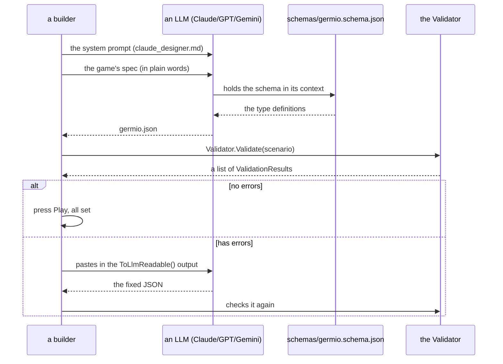
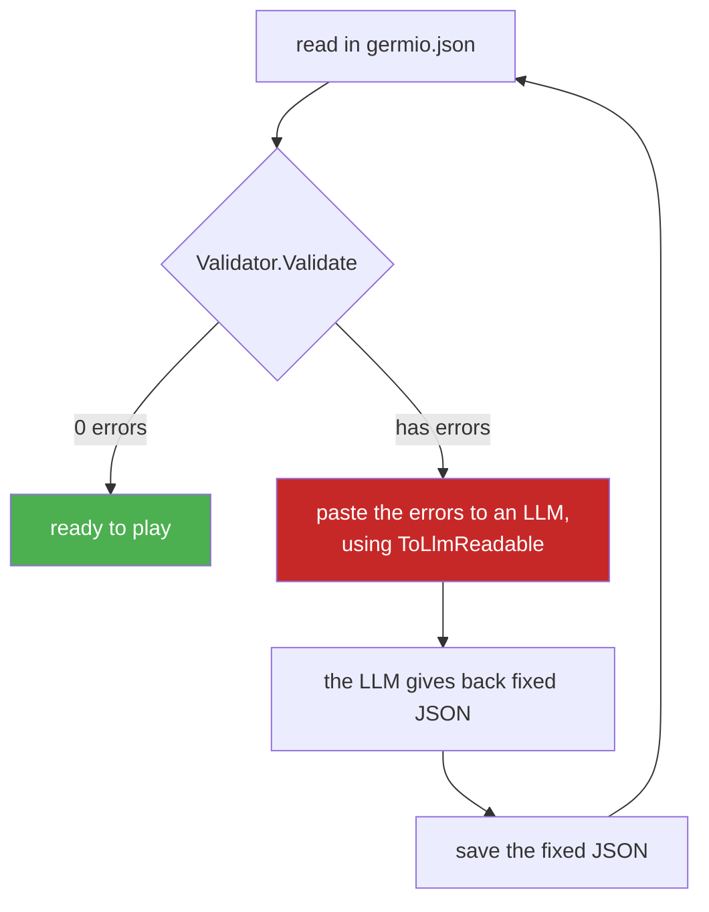
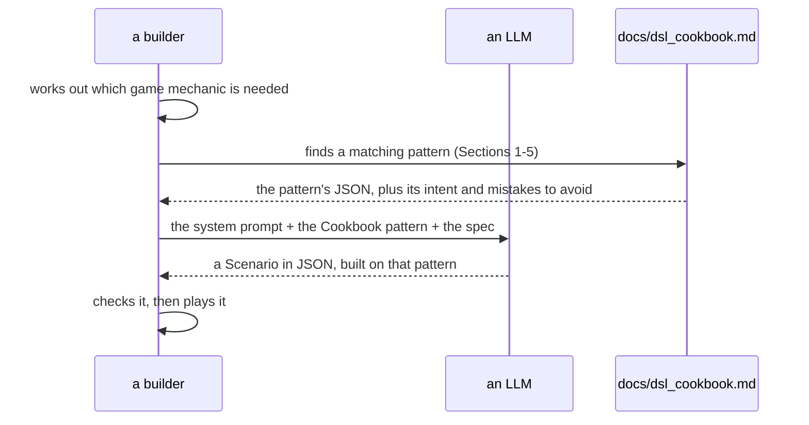
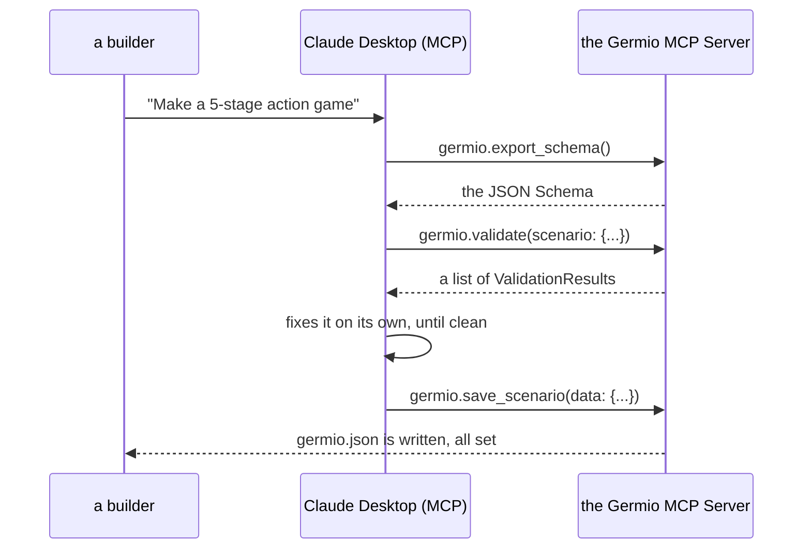

# Germio LLM Workflow Guide

> **Version**: 2.2
> **Meant for**: builders using an LLM (Claude / GPT / Gemini) to write Germio scenarios

---

## What this guide covers

This guide sets out the **full path, start to finish**, for writing
`germio.json` together with an LLM. It is meant both for a human learning
Germio for the first time, and for an LLM working within this path.

---

## 1. Quick Start (5 minutes)

### Step 1: get your Schema's address

+ **local** (the way we suggest): `schemas/germio.schema.json` (kept in
  the repository)
+ **public** (planned, later): `https://germio.dev/schemas/germio.schema.json`

### Step 2: paste a system prompt into your LLM

+ for Claude: paste in `prompts/system/claude_designer.md`
+ for GPT-4o / GPT-5: paste in `prompts/system/gpt4_designer.md`
+ for Gemini: paste in `prompts/system/gemini_designer.md`

For a quick edit (adding one stage, fixing one rule), use the `*_quick.md`
versions instead.

### Step 3: send in your game's spec

An example prompt:

```text
Make a 5-stage action game. Lives system (3 lives), up to 3 continues.
```

### Step 4: save what comes back

Save the LLM's output as `Assets/StreamingAssets/germio.json`.

### Step 5: check it

```csharp
var scenario = await Storage.LoadAsync(base_path: Application.streamingAssetsPath);
var errors = Validator.Validate(scenario: scenario);
foreach (var e in errors) Debug.LogError(e.ToLlmReadable());
```

### Step 6: feed errors back, and try again

If there are errors, paste the `ToLlmReadable()` output straight into the
LLM's chat, and ask for a fixed version. Do this again until it comes
back clean.

---

## 2. Workflow Charts

### 2.1 The first build



### 2.2 Fixing errors, round after round



### 2.3 Mermaid and JSON, going both ways

```mermaid
flowchart LR
    MD[a Mermaid sketch\n"think in pictures"] -- MermaidParser.Parse --> JSON[germio.json]
    JSON -- Grapher.Export --> MD
    JSON --> Val[Validator.Validate]
    Val -->|errors| Fix[fixed, through an LLM or by hand]
    Fix --> JSON
    JSON --> Unity[the Unity Editor\npress Play]

    style MD fill:#1565c0,color:#fff
    style JSON fill:#2e7d32,color:#fff
    style Unity fill:#4a148c,color:#fff
```

### 2.4 Writing with help from the Cookbook



---

## 3. Writing a Good Prompt for Germio

### 3.1 Always give it the JSON Schema

Put the schema in your system prompt, or attach it as a file:

```text
Here is the Germio JSON Schema you must follow:
<schema>
[paste the contents of schemas/germio.schema.json here]
</schema>
```

The schema holds the LLM to:

+ `snake_case` field names, all the way through
+ one single `command` object per rule (not a list called `actions`)
+ `next[].id` as the target of a transition (not `target_id`)

### 3.2 Always give it the naming rule

Put this piece into every prompt:

```text
NAMING RULE (zero tolerance):
- ALL JSON keys MUST be snake_case
- Forbidden: setFlag, updateCounter, firedEvents, target_id, update_inventory.id
- Required:  set_flag, update_counter, current_node, id,        update_inventory.key
```

### 3.3 Use Cookbook patterns as examples in the prompt

Rather than asking the LLM to make up a pattern from nothing, give it a
matching pattern straight from `docs/dsl_cookbook.md`:

```text
Use this existing pattern as the basis:
[paste Pattern 2.2 from dsl_cookbook.md for time-limit mechanics]
Adapt it for: countdown from 90 seconds, with 3 lives.
```

### 3.4 Show Validator errors word for word (use ToLlmReadable())

Never put an error into your own words. Paste it in exactly as given:

```text
The following validation errors occurred. Fix them:

[V006][Error] Node 'stage_boss' has next transition to unknown node 'final_boss'.
Path: $.root..[?(@.id='stage_boss')].next[0].id
Cause: No node with id 'final_boss' was found in the Scenario tree.
Fix: Add a node with id 'final_boss', or change next[0].id to an existing node id.
```

---

## 4. Common Workflows

### 4.1 Workflow A: starting from nothing

1. Pick a system prompt: `claude_designer.md`, for writing the whole
   thing
2. Describe your game in plain words (its genre, how many stages, its
   mechanics)
3. Check the output; fix any errors
4. Optionally, look at it as a picture: `Grapher.Export(root: scenario)`
   gives a Mermaid string

**Prompt tasks worth using**: `prompts/tasks/create_action_game.md`, or
`prompts/tasks/create_adventure_game.md`, or
`prompts/tasks/create_scenario.md`

### 4.2 Workflow B: adding a stage to a scenario already there

1. Use the quick prompt: `claude_quick.md`
2. Attach the JSON as it stands, with an instruction: "Insert stage
   'lv_bonus' between lv_02 and lv_03"
3. Use the task template: `prompts/tasks/add_level.md`
4. Check just the new piece, then put it into your file

### 4.3 Workflow C: fixing a validation error

1. Run `Validator.Validate(scenario: scenario)` in your own test suite
2. Gather every error as a `ToLlmReadable()` string
3. Use the task template: `prompts/tasks/fix_validation_error.md`
4. Paste in the JSON, plus the list of errors; ask for the smallest fix
   that works

### 4.4 Workflow D: cleaning up a scenario with too much repeated in it

1. Use `Grapher.Export()` to see the flow as it stands, as a picture
2. Find the patterns that repeat (the same rule copied across 5 levels,
   and so on)
3. Use the task template: `prompts/tasks/refactor_progression.md`
4. Check that the cleaned-up version still moves between the same
   states as before

### 4.5 Workflow E: turning a Mermaid sketch into JSON

1. Draw a Mermaid flowchart of how your game moves forward:

   ```mermaid
   flowchart LR
     title --> lv_01
     lv_01 -->|flag.goal == true| lv_02
     lv_02 --> ending
   ```

2. Run `MermaidParser.Parse(mermaid: diagramString)` to get back a
   `Scenario`
3. Fill in the rules, commands, and starting state
4. Check it, and fix what needs fixing

---

## 5. Tips for Each LLM

### 5.1 Claude (Sonnet / Opus)

**Where it does well:**

+ keeps the G17 naming rule better than the other two (its snake_case is
  close to perfect)
+ very good at following a system prompt with many sections
+ strong step-by-step reasoning for a complex branching flow

**Its own quirks:**

+ may add too many `_comment` fields — tell it plainly to leave these out
+ tends to add a level nobody asked for (such as a `lv_loading` between
  every stage)
+ use Opus for a large scenario (over 10 levels); Sonnet is enough for a
  routine edit

**Prompt to use**: `prompts/system/claude_designer.md`

### 5.2 GPT-4o / GPT-5

**Where it does well:**

+ holds close to the schema, once the schema is given right in the
  prompt
+ reliable at following an instruction given as a table
+ good at making several separate fixes in one pass

**Its own quirks:**

+ sometimes makes up `"action"` or `"actions"` instead of `"command"` —
  add a plain "this is wrong" example to the prompt
+ may write an inventory key in camelCase (`keyItem`, instead of
  `key_item`)
+ thinks well in tables; give the naming rules as a table in the prompt

**Prompt to use**: `prompts/system/gpt4_designer.md`

### 5.3 Gemini Pro / Ultra

**Where it does well:**

+ stronger at Mermaid output than at JSON (best used for turning a
  picture into JSON, through MermaidParser)
+ good at turning a Japanese spec into a working scenario

**Its own quirks:**

+ drifting into camelCase is the most common mistake (`setFlag`,
  `currentScene`)
+ use a "zero tolerance" line at the top of the naming part of the
  system prompt
+ note: `fired_rules` was taken out — tracking a once-fired rule is now
  handled through `Snapshot.history`

**Prompt to use**: `prompts/system/gemini_designer.md`

---

## 6. MCP Link-up (a preview)

Germio is built so it can be offered as an MCP (Model Context Protocol)
server. See `docs/mcp_spec.md` for the full design. Once MCP is ready to
use, the whole path becomes much simpler:



**MCP tools planned** (for after v1.0):

| Tool | What it is for |
| --- | --- |
| `germio.load_scenario` | reads germio.json |
| `germio.save_scenario` | writes germio.json |
| `germio.validate` | gives back errors, in G12 form |
| `germio.export_mermaid` | turns a Scenario into Mermaid |
| `germio.parse_mermaid` | turns Mermaid into a Scenario |
| `germio.evaluate_condition` | tries out a DSL condition string |
| `germio.export_schema` | gives back the JSON Schema |
| `germio.migrate` | brings an old save file up to date |

---

## 7. FAQ

### Q1: Can I edit the JSON by hand?

Yes. The JSON Schema gives you auto-complete in an IDE (VS Code, plus a
JSON language server). Point your workspace's `.vscode/settings.json` at
`schemas/germio.schema.json`:

```json
{
  "json.schemas": [{
    "fileMatch": ["germio.json"],
    "url": "./schemas/germio.schema.json"
  }]
}
```

### Q2: Can I mix parts written by hand with parts an LLM built?

Yes. The way we suggest is to have the LLM build the skeleton (the root,
the children, the `next` transitions) and fill in triggers, rules, and
commands, while a human looks it over and tunes the thresholds and
condition strings by hand.

### Q3: How do I handle a schema change over time?

There is no such mechanism in the code as it stands — the `Migrator`
class was taken out in Phase 5.8 v2, since the schema was not yet public.
`Scenario.schema_version` is always `1`. An older save file will simply
fail to load. If the schema is ever raised past version 1, a new
Migrator will need to be built again. See `docs/save_data_spec.md` §2.3
for why.

### Q4: What if the LLM keeps building the same wrong pattern?

1. Name the wrong pattern plainly (say, the LLM keeps writing
   `"actions": [...]`)
2. Add a plain "this is wrong" line to the system prompt:

   ```text
   NG: "actions": [...]  <- WRONG
   OK: "command": { ... }  <- correct, single object
   ```

3. If the pattern is already in `docs/dsl_cookbook.md` Section 6, point
   right at it
4. If not, think about adding it to Section 6 of the Cookbook

### Q5: How does Germio stand against PlayMaker / Yarn Spinner / Ink, for use with an LLM?

| | Germio | PlayMaker | Yarn Spinner | Ink |
| --- | --- | --- | --- | --- |
| what an LLM builds | yes: JSON | no: a visual graph | no: its own `.yarn` DSL | no: its own `.ink` DSL |
| a public JSON Schema | yes, public | no | no | no |
| built into Unity | yes, natively | yes, natively | yes, as an asset | yes, as an asset |
| built for dialogue | no | no | yes | yes |
| built for stages and levels | yes | only in part | no | no |

Germio is built, in particular, for **the logic behind how a game moves
forward** (stages, states, items, transitions). It does not handle NPC
dialogue (use Yarn Spinner or Ink for that) or a complex animation state
machine (use Unity's own Animator, or PlayMaker, for that).

---

## 8. References

| Document | What it is for |
| --- | --- |
| `docs/dsl_spec.md` | the full grammar for a condition string |
| `docs/dsl_cookbook.md` | 25+ patterns for common game mechanics |
| `docs/naming_spec.md` | the G16/G17/G18 naming theorem |
| `docs/llm_design_spec.md` | the full design philosophy (G9-G18) |
| `docs/security_spec.md` | the Vault, AES, and key handling |
| `docs/save_data_spec.md` | the schema's version, migration, and every field |
| `docs/mcp_spec.md` | the MCP server's design (a preview) |
| `schemas/germio.schema.json` | the published JSON Schema |
| `prompts/system/` | the LLM system prompts |
| `prompts/tasks/` | prompt templates, one per task |
| `prompts/examples/` | JSON examples, to learn from |
