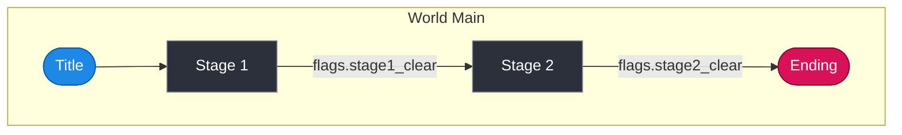

# MCP Server Design — Germio Framework v2.2

> **State**: design only (P5-T8). Building it is planned for Phase 7 (an
> optional task, for after v1.0).
> **A note on G14**: MCP is one way to reach Germio, not the only way.
> Every core feature stays open with no MCP at all, through the plain C#
> API.

## Overview

The Germio MCP (Model Context Protocol) server opens up the framework's
own scenario tools as a set of JSON-RPC tools, so that any client that
speaks MCP (Claude Desktop, Claude Code, Continue.dev, and the rest) can:

1. read in and look over a `germio.json` scenario already there
2. check a scenario, and get back a report of errors laid out clearly
3. build a Mermaid flow picture from a scenario
4. read a Mermaid picture back into a scenario
5. try out a DSL condition string against a made-up State
6. save (write) a changed scenario back to disk

```text
Claude Desktop / Claude Code
    |  the MCP protocol (JSON-RPC, over stdio)
    v
GermioMcpServer (a C# .NET 9 console app)
    |  passes work along to
    v
Germio.Core (Storage, Vault, Store, Validator, Grapher, MermaidParser, Evaluator, Executor, ExprLexer, ExprParser, ExprAst, ScenarioNavigator); Germio.Schema (SchemaExporter)
    |  reads and writes
    v
germio.json / germio.dat
```

---

## Tool Definitions

An MCP tool's name follows the shape `namespace.verb_noun` (with a dot
between the two parts).

### Tool 1: `germio.load_scenario`

**What it does**: reads `germio.json` (or `.dat`) from a path, and gives
back the Scenario.

**What goes in**:

```json
{
  "type": "object",
  "properties": {
    "path": {
      "type": "string",
      "description": "Absolute or relative path to the directory containing germio.json"
    }
  },
  "required": ["path"]
}
```

**What comes back**:

```json
{
  "success": true,
  "scenario": { "schema_version": 1, "initial_state": { "..." }, "root": { "id": "...", "children": [] } },
  "source_file": "germio.json"
}
```

**If it goes wrong**:

```json
{
  "success": false,
  "error": "File not found: germio.json"
}
```

**What this calls, underneath**: `Germio.Core.Storage.LoadAsync(base_path:
path)`. Bringing an old schema up to date is **not built** in the code as
it stands — the `Migrator` class was taken out in Phase 5.8 v2, since the
schema was not yet public. If `schema_version` is ever raised past 1, a
new Migrator will need to be built again.

---

### Tool 2: `germio.save_scenario`

**What it does**: writes a Scenario out to disk, as `germio.json` (or, if
asked, as an encrypted `.dat` file).

**What goes in**:

```json
{
  "type": "object",
  "properties": {
    "scenario": {
      "type": "object",
      "description": "The Scenario JSON object to save"
    },
    "path": {
      "type": "string",
      "description": "Absolute or relative path to the output directory"
    },
    "encrypt": {
      "type": "boolean",
      "default": false,
      "description": "If true, save as AES-encrypted .dat instead of plain JSON"
    }
  },
  "required": ["scenario", "path"]
}
```

**What comes back**:

```json
{
  "success": true,
  "written_path": "/path/to/germio.json"
}
```

**What this calls, underneath**: `Germio.Core.Storage.SaveAsync(data:
scenario, encrypt: encrypt, base_path: path)`

---

### Tool 3: `germio.validate`

**What it does**: runs every Germio validation rule (V000-V027) against a
Scenario, and gives back a list of ValidationResults.

**What goes in**:

```json
{
  "type": "object",
  "properties": {
    "scenario": {
      "type": "object",
      "description": "The Scenario object to validate"
    }
  },
  "required": ["scenario"]
}
```

**What comes back**:

```json
{
  "valid": true,
  "error_count": 0,
  "warning_count": 0,
  "results": [
    {
      "severity": "Error",
      "rule_id": "V006",
      "message": "Node 'boss_stage' → next.id 'final_boss' does not exist in the Scenario.",
      "cause_detail": "No node with id 'final_boss' was found in the Scenario tree.",
      "fix_suggestion": "Add a node with id 'final_boss' to the tree, or correct the typo.",
      "suggested_json": "",
      "location": {
        "json_path": "$.root..[?(@.id='boss_stage')].next[0].id",
        "line": 0,
        "column": 0,
        "context_snippet": ""
      }
    }
  ]
}
```

**Validation rules** (V000-V027, with gaps at V013-V019, V022, and V023):

| Code | How serious | What it checks |
| --- | --- | --- |
| V000 | Error | `Scenario.root` is null (checking stops right away) |
| V001 | Warning | a `condition` points to a flag key not in the starting `state.flags` |
| V002 | Warning | a `condition` points to a counter key not in the starting `state.counters` |
| V003 | Warning | a `condition` points to an inventory key not in the starting `state.inventory` |
| V004 | Error | a `Node.id` is not unique across the whole Scenario |
| V005 | Error | the same `rule.id` is used twice within one node |
| V006 | Error | `next[].id` points to a node that does not exist in the Scenario |
| V007 | Warning | `rule.condition` is empty — the rule fires no matter what |
| V008 | Warning | `once=false`, together with a `set_flag` command — a risk of an endless loop |
| V009 | Error | a condition's DSL has a parse error, or breaks a type rule (an unknown prefix, a bare counter, an ordering operator used on flags, a float compared with an inventory value) |
| V010 | Error | `command` has no field set at all — the rule has no effect |
| V011 | Warning | a node has no `rules` and no `next` — a dead end |
| V012 | Error | a loop back through node transitions is found, through a search |
| V020 | Error | `Node.scene` is not unique across the Scenario (an empty string does not count) |
| V021 | Error | a leaf node (with empty `children`) has no `scene` value |
| V024 | Error | the node tree goes deeper than `MAX_NODE_DEPTH` |
| V025 | Warning | the node tree goes deeper than `warning_node_depth` |
| V026 | Error | a loop back to an earlier node: `children` holds an ancestor's own ID |
| V027 | Warning | `command.request_notify` is empty or whitespace-only |

**What this calls, underneath**: `Germio.Core.Validator.Validate(scenario:
scenario)`

---

### Tool 4: `germio.export_mermaid`

**What it does**: builds a Mermaid `graph TD` picture, as a string, from a
Scenario.

**What goes in**:

```json
{
  "type": "object",
  "properties": {
    "scenario": {
      "type": "object",
      "description": "The Scenario to export"
    }
  },
  "required": ["scenario"]
}
```

**What comes back**:

```json
{
  "mermaid": "graph TD\n    classDef default fill:#2B303A,...\n    subgraph world_main [\"World\"]\n    ...\n    end\n    ..."
}
```

**An example of the Mermaid output** (the real shape `Grapher.Export`
gives):



Rules for how a node is drawn:

+ a name holding "Title" or "Start" → a pill shape, `([...]):::start`
+ a name holding "End" or "Over"   → a pill shape, `([...]):::endNode`
+ every other node                  → a plain box, `[...]` (the default)

**What this calls, underneath**: `Germio.Core.Grapher.Export(scenario:
scenario)`

---

### Tool 5: `germio.parse_mermaid`

**What it does**: reads a Mermaid `graph TD` string (or a `flowchart`
form of it), and gives back a Scenario skeleton (root, children, next).
Rules and State come back empty.

**What goes in**:

```json
{
  "type": "object",
  "properties": {
    "mermaid": {
      "type": "string",
      "description": "Mermaid string in the format output by germio.export_mermaid"
    }
  },
  "required": ["mermaid"]
}
```

**What comes back (it worked)**:

```json
{
  "success": true,
  "scenario": {
    "schema_version": 1,
    "initial_state": { "flags": {}, "counters": {}, "inventory": {}, "persistence": {}, "current_node": "", "current_team": "" },
    "root": { "id": "world_main", "name": "World", "kind": "world", "scene": "", "children": [] }
  },
  "errors": []
}
```

**What comes back (a parse error)**:

```json
{
  "success": false,
  "scenario": null,
  "errors": [
    { "line": 3, "message": "Unexpected token 'xyz' in edge definition" }
  ]
}
```

**What this calls, underneath**:
`Germio.Core.MermaidParser.TryParse(mermaid: text)`

---

### Tool 6: `germio.evaluate_condition`

**What it does**: tries a DSL condition string against a made-up State,
and gives back `true` or `false`. Used to debug and try out a condition.

**What goes in**:

```json
{
  "type": "object",
  "properties": {
    "condition": {
      "type": "string",
      "description": "The DSL condition expression to evaluate. Example: \"flags.stage1_clear && counters.score >= 100\""
    },
    "state": {
      "type": "object",
      "description": "The State object to evaluate against (must include flags, counters, inventory)",
      "properties": {
        "flags":     { "type": "object", "additionalProperties": { "type": "boolean" } },
        "counters":  { "type": "object", "additionalProperties": { "type": "number" } },
        "inventory": { "type": "object", "additionalProperties": { "type": "integer" } }
      }
    }
  },
  "required": ["condition", "state"]
}
```

**What comes back (it worked)**:

```json
{
  "result": true,
  "expression": "flags.stage1_clear && counters.score >= 100",
  "error": null
}
```

**What comes back (a parse or evaluation error)**:

```json
{
  "result": null,
  "expression": "state.flags.x",
  "error": "Unknown prefix 'state' at position 0. Valid prefixes: flags, counters, inventory"
}
```

**An example call**:

```json
{
  "condition": "flags.stage1_clear && counters.score >= 100",
  "state": {
    "flags":     { "stage1_clear": true },
    "counters":  { "score": 150.0 },
    "inventory": {}
  }
}
```

→ `{ "result": true, ... }`

**What this calls, underneath**: `Germio.Core.Evaluator.Evaluate(condition:
expr, state: state)`

---

## The Overall Shape

```text
+------------------------------------------------------------+
|  an MCP client (Claude Desktop / Claude Code / Continue.dev)|
|                                                              |
|  A user: "Check this scenario, and show me the errors"     |
+---------------------+----------------------------------------+
                      | JSON-RPC (stdio / SSE)
                      | tools: germio.validate, germio.load_scenario, ...
                      v
+------------------------------------------------------------+
|  GermioMcpServer  (a C# .NET 9 console app)                 |
|                                                              |
|  McpToolDispatcher                                          |
|   +-- germio.load_scenario  -> Storage.LoadAsync             |
|   +-- germio.save_scenario  -> Storage.SaveAsync             |
|   +-- germio.validate       -> Validator.Validate            |
|   +-- germio.export_mermaid -> Grapher.Export                |
|   +-- germio.parse_mermaid  -> MermaidParser.TryParse        |
|   +-- germio.evaluate_condition -> Evaluator.Evaluate        |
+---------------------+----------------------------------------+
                      | a plain C# call (into Germio.Core)
                      v
+------------------------------------------------------------+
|  Germio.Core                                                |
|  Storage / Vault / Validator / Grapher                     |
|  MermaidParser / Evaluator / Executor                       |
|  Germio.Schema                                              |
|  SchemaExporter                                              |
+---------------------+----------------------------------------+
                      | reading and writing files
                      v
+------------------------------------------------------------+
|  germio.json  (while building)                               |
|  germio.dat   (a finished build, encrypted with AES-256)    |
+------------------------------------------------------------+
```

---

## Linking Up with the Unity Editor

`Scripts/Editor/McpServerMenu.cs` adds **Tools → Germio → MCP Server →
Start MCP Server** to the Unity Editor's own menu.

What it does:

1. builds the `GermioMcpServer` console app, through `dotnet publish`
2. starts it as a child process, linked to `stdio`
3. prints how to connect to it, in the Unity Console
4. gives **Tools → Germio → MCP Server → Stop MCP Server**, to end it

This lets a game designer start the MCP server without ever leaving the
Unity Editor.

---

## Staying Neutral Across LLMs (G14)

Under **G14 (staying neutral across LLMs)**:

+ the MCP server is **one channel among others** — never a must
+ all 6 tools are a thin layer sitting on top of `Germio.Core`'s own
  public methods
+ the same work can also be done through:
  + plain C# code (calling the API directly)
  + the Unity Editor's own Dashboard (`Scripts/Editor/Dashboard.cs`)
  + a CLI (running `dotnet run`, through a CLI adapter not yet built)
  + MCP (as set out in this document)
+ nothing Germio can do is locked to MCP alone

---

## Points on Security

+ the MCP server runs **only on the local machine** (it never binds to a
  remote address)
+ the AES encryption key (`germio_key.bin`) is never put into a tool's
  own output
+ `germio_key.bin` and `.env` are left out of anything
  `germio.load_scenario` sends back
+ `germio.save_scenario`, called with `encrypt: true`, needs
  `Vault.GetKey()` to succeed (either the setting or the key file must be
  there)
+ every file path is worked out relative to the project's own root; a
  full path pointing outside the project's root is turned down

---

## Building This Is Put Off

As set out in Phase 5's DoD (P5-T8), **building this is put off until
Phase 7 (after v1.0)**. This document sets out the shape of the API
alone. The MCP server's own program, `McpToolDispatcher`, and the
JSON-RPC transport layer are none of them built yet.

The empty placeholder menu item in the Unity Editor (`McpServerMenu.cs`)
is built in P5-T8, only to hold this spot for later.

---

## The Tool Set, Fixed (P5.5)

Once built (a task for after v1.0), the MCP server will offer the
following tools, taken straight from the C# API finished in Phase 5:

| MCP tool | Calls this C# API | What it is for |
| --- | --- | --- |
| `germio.load_scenario` | `Storage.LoadAsync()` | reads germio.json |
| `germio.save_scenario` | `Storage.SaveAsync()` | writes germio.json (encryption optional) |
| `germio.validate` | `Validator.Validate()` | gives back errors, in G12 form, as JSON |
| `germio.export_mermaid` | `Grapher.Export()` | turns a Scenario into a Mermaid string |
| `germio.parse_mermaid` | `MermaidParser.Parse()` | turns a Mermaid string into a Scenario |
| `germio.evaluate_condition` | `Evaluator.Evaluate()` | tries out a DSL condition string |
| `germio.export_schema` | `SchemaExporter.Export()` | gives back the JSON Schema (or a plain file) |

Note: every tool name follows `germio.<verb>_<noun>`, in snake_case
(under G17). An MCP client (such as Claude Desktop) sees the very same
names the JSON Schema itself uses, so there is never a gap between one
name and the other.
